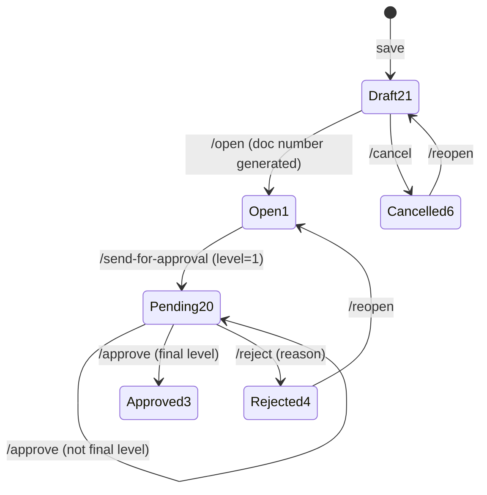

# Skill: add-approval-workflow

Last verified: 2026-06-12

## When to use

A transaction (header+detail document with a `status_id`) needs the standard approval lifecycle.
Existing implementations: Indent, PO, Quotation, Sales Order, Sales Invoice, Delivery Order,
Jute MR, Voucher.

## Status model (fixed — IDs must match the backend exactly)

21 Draft → 1 Open → 20 Pending Approval → 3 Approved / 4 Rejected / 5 Closed / 6 Cancelled

## Questions to ask the user FIRST (never assume)

1. **Which transaction + module?** Header table must have `status_id` and `approval_level` columns
   (if missing, add via `migration-writer` patterns — see existing
   `dbqueries/migrations/add_approval_level_to_*.sql`).
2. **How many approval levels?** Fixed count or driven by the approval hierarchy configured in
   dashboardadmin?
3. **Approve-with-value variant?** Some flows (e.g. Indent) expose `/approve-with-value` where the
   approver can amend quantities/values — needed here?
4. **Reopen target:** does `/reopen` return the document to Open (1) or Draft (21)?
5. **Doc number format** generated at `/open` (see `format_inward_no()` style helpers).

## Procedure

### Backend (this repo)

1. Implement the endpoints on the transaction's router per `CLAUDE.md` → "Approval Workflow
   (Backend APIs Required)": `/open` (21→1 + doc number), `/cancel` (21→6),
   `/send-for-approval` (1→20, level=1), `/approve` (20→20 next level, or 20→3 at final level),
   `/reject` (20→4, accepts `reason`), `/reopen` (6 or 4 → answer from question 4).
   Reference implementation: `src/procurement/indent.py`.
2. Tests for every transition + an invalid-transition case (e.g. approve from Draft must fail).

### Frontend (`../vowerp3ui`)

3. Constants in `src/utils/api.ts` + service functions (`update{X}Status` style) — see
   `src/utils/indentService.ts` for the canonical naming (`{X}_OPEN`, `{X}_SEND_FOR_APPROVAL`, ...).
4. `use{X}Approval` hook + approval bar using
   `src/components/ui/transaction/ApprovalActionsBar.tsx` (button visibility contract is documented
   in `../vowerp3ui/instructions.md`). Reference:
   `src/app/dashboardportal/procurement/indent/createIndent/hooks/useIndentApproval.ts`.

### Afterwards

5. Update the module guide's `approval-flows.md` (state diagram + endpoint table) — ask the user
   first (team maintenance norm).

## Verification

- pytest covers every transition; invalid transitions rejected.
- UI walkthrough on dev3: draft → open → send → approve (each level) → approved; reject + reopen
  paths; buttons appear/disappear per status exactly as in `instructions.md`.
