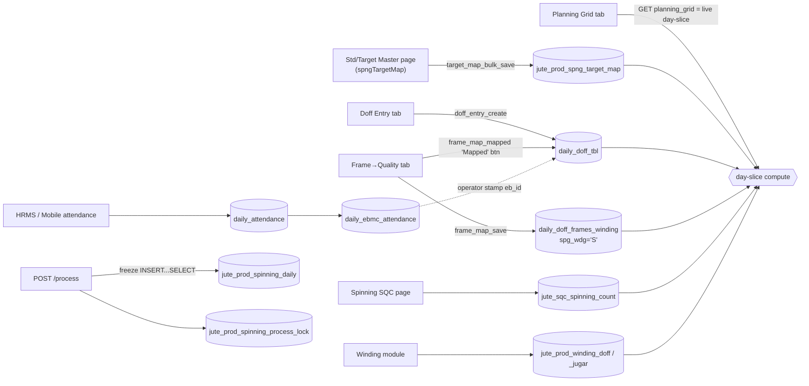

# Spinning Doff — Full Process Spec Sheet

**Scope:** Spinning production (doff entry → frame/quality map → attendance/operator sync → planning grid → Process/freeze), the tables every step posts to, mid-shift quality & operator changes, the Sync action, exception handling, weight-entry validation defects, unused/redundant column audit, and the vowsls legacy-data import that must flow through the same pipeline.

**Evidence base:** code recon of both repos + live column-usage profiling of `dev3`, `sls`, and `vowsls` (2026-07-25).

---

## 1. Current process — end-to-end flow



### 1.1 Pages

| Page | Path (FE) | Tabs / sections |
|---|---|---|
| Spinning Production | `../vowerp3ui/src/app/dashboardportal/juteProduction/spinning/page.tsx` | Doff Entry, Frame → Quality, Planning Grid (shared Date + Spell selectors; branch auto/pick from sidebar) |
| Spinning Standards / Targets | `../vowerp3ui/src/app/dashboardportal/juteProduction/masters/spngTargetMap/page.tsx` | Single grid: Type (`mcid`/`qid`) × Role (`standard`/`target`) × Effective Date |
| Spinning SQC (actuals + counts) | juteSQC pages | writes `jute_sqc_spinning_count`; actual speed/TPI role rows via shared TargetMapEditor (`value_role='actual'`) |
| Attendance | HRMS portal page + mobile app (face/manual) | writes `daily_attendance` + `daily_ebmc_attendance` |

### 1.2 API inventory — endpoint → function → **table posted to**

Prefix `/api/spinningProd` (routers `src/juteProduction/spinning_entry.py`, `spinning_process.py`):

| Method + path | Handler (file:line) | What it does | Posts to |
|---|---|---|---|
| GET `/doff_entry_create_setup` | `doff_entry_create_setup` (spinning_entry.py:238) | Machines (+ **as-of-today** bobbin wt), spells, trollies (spinning-tagged), yarn items | read-only |
| GET `/doff_machine_prev_state` | spinning_entry.py:334 | Running net total, next doff #, **as-of-tran_date tare** | read-only |
| POST `/doff_entry_create` | spinning_entry.py:385 | Server computes tare (trolly + busket + bobbin@tran_date) and net; validates net ∈ [5, 60] kg; derives branch from machine if omitted; lock-gated | **`daily_doff_tbl`** INSERT (`doff_date, spell←spell_id, mc_id, quality_id=NULL, item_id, trolly_id, gross/tare/net, weight_type='SPG1', active=1, branch_id, updated_by`) |
| PUT `/doff_entry_edit/{id}` | spinning_entry.py:499 | Re-computes tare/net (from **current** trolly_mst — defect §7.3), revalidates, lock-gated | **`daily_doff_tbl`** UPDATE (trolly, gross, tare, net, item_id, updated_by) |
| DELETE `/doff_entry_delete/{id}` | spinning_entry.py:581 | Soft delete, lock-gated | **`daily_doff_tbl`** UPDATE `active=0` |
| POST `/doff_dedup_run` | spinning_entry.py:628 | ⚠️ Keeps only MAX(id) per machine per (date, spell), deactivates the rest — see §6 W10 | **`daily_doff_tbl`** UPDATE `active=0` (bulk) |
| GET `/doff_entries_by_date` | spinning_entry.py:454 | Grid rows; yarn = `COALESCE(dd.item_id, frame-map item)` | read-only |
| GET `/frame_map_get` | spinning_entry.py:657 | Today's saved map + latest prior mapping as draft carry-forward | read-only |
| POST `/frame_map_save` | spinning_entry.py:725 | Upsert **one active row per (tran_date, spell_id, machine)**; no history within a spell | **`daily_doff_frames_winding`** INSERT/UPDATE (`spg_wdg='S'`, spell name + spell_id, mc_eb_id←machine, item_id, branch_id, updated_by/`_date_time`) |
| POST `/frame_map_mapped` ("Mapped" btn) | spinning_entry.py:789 | (a) **back-stamps `item_id`** onto all doff rows of machine/spell/date from the map (overwrites — §5.3); (b) **operator stamp `eb_id`** from attendance join | **`daily_doff_tbl`** UPDATE `item_id`, `eb_id` |
| GET `/planning_grid` | spinning_entry.py:848 | Locked unit → frozen rows; else ONE live day-slice execution + shift rollup | read-only |
| POST `/process` | spinning_process.py:50 | BLOCK unmapped-produced machines; WARN lists; soft-delete + `INSERT…SELECT` freeze of the same slice; lock upsert | **`jute_prod_spinning_daily`** (freeze), **`jute_prod_spinning_process_lock`** |
| GET `/process_status` | spinning_process.py:115 | Drift detection (count/doff/winding) → raises `reprocess_needed` | lock row UPDATE (flag only) |

Prefix `/api/spngTargetMap` (`src/juteProduction/spng_target_map.py`): `target_map_setup` / `target_map_list` / `target_map_grid` (read-only), `target_map_create` (INSERT — ⚠️ no exact-key dedupe, unlike bulk_save), `target_map_edit`, `target_map_delete` (soft), `target_map_bulk_save` (upsert at exact key `(co_id, ref_id, id_type, value_role, param, effective_date)`, value must be finite ≥ 0) → all post to **`jute_prod_spng_target_map`**. Branch is filter-only: resolution ignores `branch_id` (a branch-scoped save can update a global row).

Prefix `/api/spinningMasters` (`src/juteProduction/spinning_masters.py`): trolly CRUD → **`trolly_mst`** (⚠️ hard DELETE — table has no `active`).

Attendance writers (feed the operator stamp):

| Endpoint | Posts to | Notes |
|---|---|---|
| POST `/api/hrms/daily_attendance_create` (hrms/attendance.py:314) | `daily_attendance` INSERT (status 20 = pending) + `daily_ebmc_attendance` per machine (`_sync_machines`: deactivate-then-reinsert scoped to own `daily_atten_id`) | dup guard on (eb_id, date, spell-string); validates hours |
| PUT `/api/hrms/daily_attendance_edit/{id}` | same, in-place header UPDATE + machine resync | blocked when status 3/4 |
| Mobile `/attendance` (face), `/mark-attendance` (manual) | same two tables | ⚠️ NO dup guard, NO hours validation, status hardcoded '3' (approved), `daily_ebmc_attendance.branch_id` NOT written |
| Mobile PUT `/attendance/{id}` | partial header UPDATE + machine resync | no lock check |

Key semantics: `daily_attendance.spell` is the **NAME string** ("A1"); `daily_doff_tbl.spell` is the **spell_id INT**; `daily_attendance.spell_id` column exists but **no writer populates it** (migration backfill only). One machine **can** have 2+ simultaneously-active workers (no uniqueness rule) — the raw material for mid-shift operator changes, and the ambiguity the sync must handle.

### 1.3 Where calculated data is computed and persisted

- **Tare/net** — computed server-side at doff create/edit (`compute_tare`/`compute_net`, `services/spinning_rules.py:21-33`); persisted on the doff row (frozen; never recomputed on read).
- **Planning metrics** (p100prod, std/target prod, eff_doff, winding allocation, eff_winding) — computed **on read** by `spinning_day_slice_sql()` (`spinning_query.py:449`); day-filtered driver, target-map last-date pivots, doff SUM per (machine, spell), SQC count AVG per (item, day), winding reconciliation (doff − opening jugar + closing jugar) per (item, shift-bucket).
- Persisted **only at Process** into `jute_prod_spinning_daily` (one row per date/spell/machine/item), then lock. Any later mutation flags `reprocess_needed`; `process_status` also detects drift on read.

---

## 2. Table posting map (master reference)

| Table | Written by | When | Grain / key |
|---|---|---|---|
| `jute_prod_spng_target_map` | target-map page bulk_save/CRUD; SQC actuals tab | ahead of time / per shift for actuals | (co, ref_id, id_type, value_role, param, effective_date); readers resolve latest ≤ tran_date |
| `daily_doff_tbl` | `doff_entry_create/edit/delete/dedup`; item_id + eb_id via Mapped/Sync; **legacy import** | every weighment | one row per doff; `spell` = spell_id INT; `weight_type='SPG1'` mandatory discriminator |
| `daily_doff_frames_winding` (S) | `frame_map_save` | once per machine/spell/day (upsert in place) | one **active** row per (tran_date, spell_id, mc_eb_id, 'S') |
| `daily_attendance` / `daily_ebmc_attendance` | HRMS + mobile | shift start (and edits) | header per (eb, date, spell-name); child per machine |
| `jute_sqc_spinning_count` | juteSQC router | per QC observation | (co, branch, date, spell, mc, item) |
| `jute_prod_winding_doff` / `_jugar` / `_daily_qlty` | winding module | winding doffs / open-close leftovers | equal-split per machine; jugar O/C per machine/spell |
| `jute_prod_spinning_daily` | **Process only** | on freeze / reprocess | (co, tran_date, spell_id, machine_id, item_id), soft-deleted on reprocess |
| `jute_prod_spinning_process_lock` | Process, drift detection | on freeze / on drift | (co, branch, tran_date, spell_id) |

---

## 3. Column audit — unused / redundant (live data, dev3 + sls)

### 3.1 `daily_doff_tbl` (dev3 29 rows / sls 165 rows)

| Column | Verdict | Evidence / action |
|---|---|---|
| `quality_id` | **DEAD** — 0 non-null in both DBs; ERP insert hardcodes NULL | superseded by `item_id`. Import must NOT use it. Drop in cleanup migration after import validated |
| `eb_id` | **defined but never landed** — 0 non-null in both DBs | only writer is operator-stamp UPDATE; dev3 attendance tables are EMPTY (structure-only prod clones, AUTO_INCREMENT ~25.8M), sls stamp never matched. Becomes active in §5 |
| `item_id` | active in dev3 (back-stamped), **all NULL in sls** | sls back-stamp gap: frame-map machines saved 2026-07-24 don't overlap the pilot doff rows' machines/spell. Sync (§5.2) is the repair |
| `updated_date_time` | **DEAD** — 0 non-null in both DBs; no ERP writer sets it | cheap fix: stamp `NOW()` on insert/update |
| `branch_id` | redundant (derivable from `mc_id` → dept → branch) but keep — scoping/index; table has **no co_id** (co rides the machine spine) | keep |
| `weight_type` | constant `'SPG1'` but an **active discriminator** the ERP filters on | every imported row must set it |

### 3.2 `daily_doff_frames_winding` (dev3 118 / sls 45 rows, all `spg_wdg='S'`)

**No current-ERP writer at all (0 non-null both DBs):** `quality_id`, `eb_id`, `sc_type`, `trolly_id`, `gross_weight`, `tare_weight`, `net_weight`, `user_id`. These are the legacy-mobile "W" (winding) payload columns — zero W rows exist anywhere; the ERP winding module writes `jute_prod_winding_*` instead. Keep only if legacy winding import targets W rows (§8 — recommendation: it should not).
**Redundant:** `spell` name string (spell_id on same row) — still written by insert; keep for now. `branch_id` derivable from machine.
**Schema drift:** `created_at` — dev3 `timestamp DEFAULT CURRENT_TIMESTAMP`, sls `datetime NULL` no default (always NULL); `updated_date_time` type differs (datetime vs timestamp). Align in a migration before import.

### 3.3 Other tables

- `jute_prod_spng_target_map`, `jute_prod_spinning_daily`, `_process_lock`, `jute_sqc_spinning_count`: carry **both `co_id` and `branch_id`** on every row — `co_id` is derivable from `branch_mst`. Verdict: redundant-but-keep (index/query convenience). **Rule going forward: new detail tables carry `branch_id` only**; keep both consistent whenever writing.
- `jute_prod_spinning_daily` zero-value columns (`act_count`, `p100prod`, `std_prod`, `target_prod`, `eff_doff`, `eff_winding` all 0 on the single processed dev3 unit) are NOT dead — the processed unit lacked spindle/speed standards. sls table empty (Process never run there).
- `spell_mst`: `break_hours`, `halfday_work_hours`, `late_minutes`, `late_minutes2` — all NULL in both DBs (UI never sends). Dead.
- `daily_attendance` (sls, 1.14M rows): `device_id` (constant 0), `attendance_mark` (constant 'P') dead; `eb_code`/`eb_no` duplicate each other and derive from `eb_id`; `spell_hours` derivable from spell_mst; `status_id` is **varchar**. `spell_id` populated by backfill only — **new rows still write only the name string**.
- `daily_ebmc_attendance` (sls, 1.2M rows): `updated_by` (all NULL), `or_mc_id` (all NULL) dead; `branch_id`/`spell`/`spell_id`/`eb_id`/`designation_id` duplicate the header (join via `daily_atten_id` — and mobile never writes `branch_id`, so **never filter this table by branch; go through the header**). Column name `attendace_date` is a production typo — never rename.

---

## 4. Current gaps (found during this audit)

| # | Gap | Where |
|---|---|---|
| G1 | **Dead FE route:** Planning Grid "Save" POSTs `SPINNING_PLANNING_GRID_SAVE` — backend endpoint was **removed** in the day-slice/Process rework (`test_spinning_planning_grid.py:557` "planning_grid_save removed"). Button 404s. Must become the **Process** button | `PlanningGrid.tsx:81-106` |
| G2 | `eb_id` has **never been stamped once** in any DB (dev3 attendance empty; sls join never matched) | §3.1 |
| G3 | sls `item_id` all NULL despite saved frame maps (machine-set/spell mismatch) — back-stamp silently stamped 0 rows, UI said success | §3.1 |
| G4 | "Save Map" cannot **clear** a mapping — FE filters out empty selections from the payload | `FrameMapGrid.tsx:79-86` |
| G5 | Doff entry form has **no yarn/quality field** — item identity only exists via the map + Mapped button | `DoffEntryForm.tsx` |
| G6 | `frame_map_mapped` operator stamp **overwrites** `eb_id` every run and is nondeterministic when 2 workers are active on one machine (multi-join UPDATE, last row wins) | `spinning_query.py:411` |
| G7 | Dedup button deactivates ALL but one doff per machine/spell — destroys legitimate multi-doff data (§6 W10) | `spinning_query.py:223` |
| G8 | Weight validation defects — see §7 | |

---

## 5. Chosen architecture — Helper + Mapper + Sync + Process (v2, decided 2026-07-27)

Supersedes the v1 frame-map-centric proposal. Quality mapping moves OFF `daily_doff_frames_winding` onto two purpose-built tables: a **current-state helper** read at every doff post, and a **mapper change-log** that owns history, as-of resolution, and retro updates. Operator (eb) stays a sync-time stamp from attendance. Process/freeze machinery stays as shipped.

**Principle:** helper = "what is Frame X spinning *right now*" (cache, one row per machine). Mapper = append-only rulebook ("Frame X → item Y effective 26-Jul B1"). Doff row = stamped confirmation — the truth Process reads. Helper is NEVER an oracle for history.

### 5.1 New tables (DDL)

Style per `jute_prod_spng_target_map` template (verified: `idx_<initials>_<purpose>` naming, InnoDB, `utf8mb4_0900_ai_ci`). Name patterns `spg_quality_*` are free in both dev3 and sls (checked). **No `co_id`** on either table — branch-only per §3.3 rule; co rides machine→dept→branch.

```sql
-- Current mapping. ONE row per machine. Written ONLY by the mapper-save code path
-- (no CRUD endpoint of its own) — helper is derived data.
CREATE TABLE spg_quality_helper (
  quality_helper_id   INT NOT NULL AUTO_INCREMENT,
  branch_id           INT NULL,              -- denormalized from machine's dept; display/scope only
  mc_id               INT NOT NULL,
  item_id             INT NOT NULL,          -- yarn item (item_mst)
  effective_from_date DATE NOT NULL,         -- copy of the producing mapper row
  effective_from_spell_id INT NULL,
  quality_mapper_id   INT NOT NULL,          -- provenance: mapper row that produced this state
  updated_by          INT NULL,
  updated_date_time   TIMESTAMP NOT NULL DEFAULT CURRENT_TIMESTAMP,
  PRIMARY KEY (quality_helper_id),
  UNIQUE KEY uq_sqh_mc (mc_id),        -- grain PENDING D9: becomes (mc_id, spell_id) if mill runs per-spell qualities
  KEY idx_sqh_branch (branch_id)
) ENGINE=InnoDB DEFAULT CHARSET=utf8mb4 COLLATE=utf8mb4_0900_ai_ci;

-- Append-only change log. Owns history, as-of resolution, retro updates.
CREATE TABLE spg_quality_mapper (
  quality_mapper_id   INT NOT NULL AUTO_INCREMENT,
  branch_id           INT NULL,
  mc_id               INT NOT NULL,
  item_id             INT NOT NULL,
  effective_from_date DATE NOT NULL,
  effective_from_spell_id INT NULL,          -- NULL = start of day; else from that spell onward
                                             -- (spell order within day = spell_mst.starting_time)
  retro_mode          VARCHAR(10) NOT NULL DEFAULT 'fill',  -- fill | synced | all (what the save applied)
  retro_rows          INT NOT NULL DEFAULT 0,               -- doff rows the retro update touched (audit)
  active              TINYINT(1) NOT NULL DEFAULT 1,
  updated_by          INT NULL,
  updated_date_time   TIMESTAMP NOT NULL DEFAULT CURRENT_TIMESTAMP,
  PRIMARY KEY (quality_mapper_id),
  KEY idx_sqm_lookup (mc_id, effective_from_date, quality_mapper_id),
  KEY idx_sqm_branch_date (branch_id, effective_from_date)
) ENGINE=InnoDB DEFAULT CHARSET=utf8mb4 COLLATE=utf8mb4_0900_ai_ci;
```

`daily_doff_tbl` additive changes (no composite index exists today — verified dev3+sls carry only single-column `idx_ddt_date/branch/mc`):

```sql
ALTER TABLE daily_doff_tbl
  ADD COLUMN item_source VARCHAR(8) NULL,    -- 'helper' | 'mapper' | 'manual' | 'import'
  ADD COLUMN eb_source   VARCHAR(8) NULL,    -- 'sync' | 'manual' | 'import'
  ADD INDEX idx_ddt_mc_date (mc_id, doff_date),      -- retro-update scope scans
  ADD INDEX idx_ddt_date_spell (doff_date, spell);   -- sync + slice day scans
```

Seed migration: latest active `daily_doff_frames_winding` S row per machine → one mapper row (`effective_from_date` = its tran_date) + helper row. Frames_winding retires as the mapping surface (D10).

`active` semantics on the mapper: the log is append-only in normal operation; `active=0` exists only to void a mistaken entry. **As-of resolution (§5.2) and the helper rebuild (§8.2) filter `active=1`**, and deactivating a mapper row re-derives the helper for that machine (helper's `quality_mapper_id` must never point at a dead row).

### 5.2 Posting flow (doff INSERT stamps identity)

1. **Fast path** (`doff_date` = current effective period): read helper by `mc_id` (unique-key lookup) → stamp `item_id`, `item_source='helper'`. Helper row missing → `item_id NULL` + warn in response (Process B1 remains the hard gate).
2. **Backdated path** (`doff_date` earlier — mills enter backlogs, proven): resolve as-of from mapper log — latest `active=1` row where `(effective_from_date, spell-order) <= (doff_date, spell)`, `ORDER BY effective_from_date DESC, spell-order DESC, quality_mapper_id DESC LIMIT 1` (spell-order via `spell_mst.starting_time`; `effective_from_spell_id NULL` sorts as day-start) → stamp with `item_source='mapper'`. **Never the helper** — it holds today's state, wrong for yesterday (T1).
3. `eb_id` stays NULL at insert; sync fills it later (§5.4).
4. `updated_date_time` = NOW() (fixes dead column).
5. Doff **edit** may set `item_id`/`eb_id` explicitly → `*_source='manual'` — protected from all sync/retro except `retro_mode='all'`.

### 5.3 Mapper save — `POST /api/spinningProd/quality_map_save`

```jsonc
{ "co_id": 1, "branch_id": 2,
  "entries": [{ "mc_id": 16, "item_id": 269876 }],
  "effective_from_date": "2026-07-27", "effective_from_spell": "B1",   // spell optional = start of day
  "retro_mode": "fill",            // fill | synced | all
  "confirm": false }               // false → preview counts only; true → commit
```

One transaction:
1. **Validate:** effective date not in the future (rejected 400 — shop-floor changes are "now" or backdated; future-dating would poison the current-state helper, T2); item active; machine active + spinning type.
2. INSERT mapper row(s).
3. Upsert helper (`uq_sqh_mc`) — same transaction, single-writer rule (T3).
4. **Retro UPDATE, scoped** `WHERE mc_id = :mc AND (doff_date, spell-order) >= effective point` (inclusive of the effective cell) — never unbounded (T5, T17):
   - `fill`: only `item_id IS NULL`
   - `synced`: also `item_source IN ('helper','mapper')` — never `'manual'`
   - `all`: everything in range — **Edit level required**
   Stamps `item_source='mapper'`.
5. **Explicitly `flag_reprocess_if_locked`** on every locked (date, spell) unit in the retro range — the drift detector compares doff SUMs per (machine, spell) and is **blind to pure item reassignment** (T6). Crossing a locked unit requires Edit level.
6. Response: `{ mapper_ids, retro_rows, reprocessed_units: [...], preview: bool }`.

**FE:** Frame→Quality tab morphs into the **rule grid** — same machine×yarn layout, each row shows current rule + "since 15-Jul A1" (reuse the target-map grid's inherited-italics pattern). Save opens the retro prompt: *"Apply from 27-Jul B1 onward: fill gaps / update synced / update all — N entries affected, M processed units will need reprocess"* (`confirm:false` preview → `confirm:true`). Mid-**spell** changes need no mapper entry at all: clerk flips the Yarn dropdown on the doff (prefilled from helper via `/doff_machine_prev_state.mapped_item_id` — **new response field, added in Phase 2**; endpoint currently returns only running_total/next_doff/tare); mapper is only for lasting changes.

Two changes to the same machine on one day: ordering = (effective point, `quality_mapper_id`) — id is the tie-break; both events stay in the log as audit (T8).

### 5.4 Sync button — `POST /api/spinningProd/doff_sync`

Absorbs `frame_map_mapped` (old route delegates for one release).

```jsonc
{ "co_id": 1, "branch_id": 2, "tran_date": "2026-07-27", "spell": "A1",
  "mode": "fill",                          // fill (default) | force (Edit only)
  "targets": ["quality", "operator"] }
```

| Target | fill (default) | force |
|---|---|---|
| quality | stamp `item_id IS NULL` rows from mapper as-of resolution (repair path — imports, missed helper rows) | overwrite rows with `item_source <> 'manual'` |
| operator | stamp `eb_id IS NULL` rows where exactly **one** unambiguous candidate | overwrite `eb_source <> 'manual'`, still skips ambiguous |

**`eb_source='manual'` rows are NEVER touched by sync in any mode** — otherwise every sync reverts supervisor corrections and re-opens wage disputes (T9, the critical one).

**Operator priority cascade** (user rule "lowest and active" = final tie-break, not the whole rule):
1. Active rows only: `dea.is_active=1`, `da.is_active=1`, `attendance_date = :tran_date`, `da.spell_id = :spell_id` (branch scope via **`da.branch_id`**, never `dea.branch_id` which mobile leaves NULL).
   **spell_id, NOT the spell name.** `spell_code` repeats once per shift generation (sls `A1` = 91/97/102), so a name join silently rakes in another generation's attendance. Safe because `daily_doff_tbl.spell` already stores a real `spell_id`, and both attendance tables carry `spell_id`.
2. `LOWER(designation_mst.desig) LIKE 'spinner%'` (escape hatch `ignore_designation`) — the operator is the spinner on the frame.
   **Prefix, not substring, and not the `on_machine` flag.** The original `on_machine = 'Yes'` rule stamped ZERO operators on sls, silently: that tenant has no `'Yes'` value at all (`'Y'`/`'N'`/`''`/`'No'`) and flags all 64 of its spinning designations `'N'`. Substring `%spinner%` also fails — it pulls in `EXTRA SPINNER@1/8 FRM (F)`, a relief hand bulk-assigned across 8+ frames, leaving 16 of 23 frames ambiguous. Measured read-only on sls 2026-01-02 br-29, the prefix resolves **23/23** (spell 97) and **22/22** (spell 98) doffed frames to exactly one eb. Exact `=` matches nothing — every `desig` carries an `(F)`/`(C)` suffix.
3. Still >1 → **lowest `daily_atten_id`** (first-marked, deterministic and repeatable). Safety net only: on real sls data step 2 already resolves every frame, and marking order is arbitrary between two genuine spinners — which is why any tie it breaks is still reported at step 4. (D11's designation-rank step is dropped: `designation_mst` has no rank column, and the spinner prefix removed the need.)
4. **Any machine that entered the cascade with >1 candidate is ALWAYS reported in `operator_ambiguous` (W4)** — regardless of which step resolved it. Stamping proceeds per the cascade, but the choice is visible, never a silent guess. Supervisor fixes via row-level eb edit (`eb_source='manual'`).

Attendance not marked yet → rows stay NULL (by design); re-run sync anytime — idempotent. **Process runs fill-sync automatically** before freezing (settlement-time catch-up; attendance is habitually late). Attendance later rejected/deactivated after stamping → W11 at Process.

Response = stamped counts + exceptions (`machines_unmapped`, `doffs_no_operator`, `operator_ambiguous`, `item_overridden`, `bobbin_missing`, `attendance_no_doffs` ← W7, populated when the operator target runs).

**Overnight spells** (C: 22:00→06:00; dev3 spell_ids 5/8, sls 95/101/108, `is_overnight=1`): convention = **shift-START date** for both `doff_date` and `attendance_date`. Post-midnight doffs of a C shift carry the previous calendar date; sync join relies on this (T12). Enforce at entry.

### 5.5 Process / day-slice changes

1. **Source of truth = the stamped `item_id` on doff rows.** Helper is read ONLY for today's mapped-but-idle frames (targets, zero actuals). **Reprocessing a past day never touches the helper** (T13) — stamped rows were correct at post time; retro maintained them. Past-day idle frames simply have no row.
2. Driver: doff rows grouped `(mc_id, spell, item_id)` ∪ helper rows (today only) for idle mapped frames. Day filter stays inside the driver WHERE (tripwire rule unchanged).
3. **BLOCK B1 = `dd.item_id IS NULL`** on produced rows (no COALESCE anymore — after stamping-at-post, NULL means unmapped at post time and unrepaired; run fill-sync, then still NULL → block).
4. Minutes attribution: single-item frame/spell → full spell minutes; multi-item (mid-shift) → `minutes × item_net / frame_net` weight share (W6). Upgrade path: time boundaries, only if the mill demands minute-exact.
5. Freeze table unchanged (already keyed date/spell/machine/item; multi-quality = N rows). **No eb column on the frozen table** — operator/wage reports aggregate `daily_doff_tbl` by `eb_id` day-scoped.
6. Drift query re-keys doff SUM on (machine, spell, item).
7. Rewire everything that reads `daily_doff_frames_winding` S rows: slice driver, backstamp (dies), `doff_entries_by_date` fallback (item now on the row), unmapped probe.

### 5.6 Staleness indicators — "is the processed table up to date?"

Three states per (branch, date, spell) unit:

| State | Meaning | Source |
|---|---|---|
| **Not processed** | `jute_prod_spinning_daily` has no active rows for the unit; grids show LIVE compute | no lock row / `is_locked=0` |
| **Processed & current** | frozen rows match entries | `is_locked=1`, `reprocess_needed=0` |
| **Processed but STALE** | entries changed after freeze (doff add/edit/delete, mapper retro, sync stamp, SQC/winding change) | `reprocess_needed=1` — set by `flag_reprocess_if_locked` on every write path + drift detection inside `GET /process_status` (sticky once tripped) |

BE is ready — `GET /api/spinningProd/process_status` exists and is tested; **FE has zero wiring** (no API constant, no hook, no bar — verified). Build = clone the weaving idiom:

- **`SpinningProcessBar`** + **`useSpinningProcessStatus`** (clones of `WeavingProcessBar` / `useWeavingProcessStatus`), mounted in `page.tsx` between the Date/Spell selector row and the tab bodies (line 190→192 slot) — **one bar, visible on all three tabs**.
- Chips: `Not processed` (default outlined) → `Processed & Locked` (green outlined) → plus warning chip **"Entries changed after processing — reprocess"** when stale. Caption when locked without Edit: *"Locked — Edit permission required to re-process or change entries."*
- Button: `Process day + spell` / `Re-process` (warning color when locked), disabled while busy/loading/locked-no-edit. Replaces the dead Planning-Grid Save (G1).
- Red BLOCK alert (unmapped machine list), yellow WARN alert (all §6 W-categories), success snackbar *"Processed N frames — day/spell locked."*
- Hook fetches on mount + date/spell/branch change + explicit refresh after Process. No polling.

**Fix weaving's known gaps rather than copying them:**
1. **Chip refreshes after ANY mutation** — every grid (doff create/edit/delete, mapper save, sync) gets an `onMutated` callback that bumps the status hook. In weaving the chip goes stale silently until the user re-clicks Search; spinning must flip to "reprocess" immediately.
2. **Render every warn category** — weaving FE silently drops `negative_jugar` and `quality_mismatch` from the wire; spinning renders all.
3. **Frozen-vs-live source tag on the grid itself:** planning grid already serves frozen rows when locked — label it *"Processed (frozen) data as of {processed_date_time}"* vs *"Live data — not processed yet"*. Add `processed_date_time` to the `process_status` response (it's on the lock row).
4. **Doff-table-level badges** (distinct from processed-table staleness): DailyDoffGrid header (flex Box next to Dedup, `DailyDoffGrid.tsx:109-120` slot) shows chips **"N doffs without quality"** / **"N without operator"** from `doff_entries_by_date` aggregate counts — tells the user the DOFF table itself is not fully stamped, next to the Sync button that fixes it.
5. **Reports reading `jute_prod_spinning_daily`**: join the lock header per day — rows from a `reprocess_needed=1` unit render a warning dot + tooltip *"Processed data outdated — entries changed after processing"*; unprocessed days marked *"live"*.

### 5.7 Edge-case test checklist

| # | Test | Expected |
|---|---|---|
| T1 | Change mapping today, insert doff dated yesterday | doff stamped from mapper as-of yesterday (`item_source='mapper'`), NOT today's helper value |
| T2 | Mapper save with future `effective_from_date` | 400 |
| T3 | Helper has no write endpoint; mapper save updates helper in same txn | helper always agrees with latest applicable mapper row |
| T4 | Doff on machine with no helper row | inserts with `item_id NULL` + response warn; Process blocks (B1) until mapped+synced |
| T5 | Mapper save effective **now**, `retro_mode=fill`, all current-spell doffs already stamped | zero rows updated; rows before the effective point never touched in any mode (earlier production was genuinely the old quality) |
| T6 | Backdated mapper save, `retro_mode=fill`, range crosses a locked unit | only NULL rows in range stamped; locked unit flagged `reprocess_needed=1`; requires Edit |
| T7 | `retro_mode=synced` | `item_source='manual'` rows untouched |
| T8 | Two mapper saves same machine same day (B then back to A) | last by (effective, id) wins in helper; both in log; retro applied in order |
| T9 | Sync fill after supervisor manually set eb on one row | manual row untouched; other NULL rows stamped |
| T10 | Two active on-machine workers on one frame | cascade → lowest `daily_atten_id` stamped, machine listed in `operator_ambiguous` (W4) |
| T11 | Mobile-created attendance (`dea.branch_id` NULL) | sync still matches (branch via `da.branch_id`) |
| T12 | C-shift doff at 01:30 | `doff_date` = shift-start date; sync matches attendance of that date |
| T13 | Reprocess last week's unit after today's mapping change | frozen rows unchanged (helper not consulted for history) |
| T14 | Mid-shift dropdown flip → two items one frame/spell | freeze produces 2 rows; minutes weight-share sums to spell minutes |
| T15 | Doff edit on a locked unit (Edit user) | saves + status chip flips to "reprocess" without page reload |
| T16 | `process_status` polled after drift-source change | `reprocess_needed` sticky once tripped |
| T17 | Backdated mapper save made AFTER the legacy import | retro stays scoped to its (machine, effective-range); the mapper change-point import itself bypasses `quality_map_save` entirely (direct INSERT, no retro — 1.4M imported rows safe) |

### 5.8 Doff Data Editor page (access-controlled corrections — replaces direct-DB edits)

User-confirmed requirement (2026-07-27): mid-shift quality AND person changes are real; historically fixed by editing `daily_doff_tbl` directly in the DB. Replacement: a **separate portal page** `juteProduction/doffDataEditor`, reachable only via its own menu entry (`menu_mst` + `role_menu_map` — grant to admin/editor roles only), so access control rides the standard menu system.

- **Grid** over `doff_entries_by_date` showing **names not ids**: machine (mech_code + name), trolly_name, yarn `item_name`, operator `eb_name` (+ eb_no), gross/tare/net, `item_source`/`eb_source` chips, active.
- **Row edit dialog**: Yarn Autocomplete + Operator Autocomplete (options from new `GET /doff_editor_setup` — yarn items + active branch workers), gross/trolly. Sends **only changed fields** — item/eb-only edits skip weight recompute (§7.3) and stamp `item_source`/`eb_source = 'manual'` (protected from sync forever).
- **Re-run Calculate** = the mounted `SpinningProcessBar`'s Process/Re-process button: any row save bumps the bar (`onMutated`) so it immediately shows *"Entries changed after processing — reprocess"*; user clicks Re-process to fix `jute_prod_spinning_daily`. Locked units without Edit level get the 403 verbatim.
- Menu: dev3 first; `portal_menu_mst` template + other tenants at deploy.

---

## 6. Exception / warning matrix

**BLOCK (HTTP 400/403 — action refused):**

| Code | Condition | Where raised |
|---|---|---|
| B1 | Produced doff rows with `item_id IS NULL` after fill-sync (unmapped at post time, unrepaired) | Process |
| B2 | Computed net outside [5, 60] kg | doff create/edit |
| B3 | Unknown spell / unknown trolly | doff create/edit, all spell-resolving endpoints |
| B4 | Mutation on a Processed+locked unit without Edit access level (403) | create/edit/delete/dedup/map-save/sync/process |
| B5 | **NEW** — no `bobbin_wt` standard effective for machine on tran_date (`NO_MACHINE_ATTR_MSG`, today dead code) | doff create/edit, prev_state |
| B6 | `mode=force` sync without Edit level | doff_sync |

**WARN (returned in response; action proceeds):**

| Code | Condition | Where |
|---|---|---|
| W1 | Mapped frame missing std speed (machine) or std tpi (item) as of tran_date | Process (exists) |
| W2 | Mapped item with no SQC count observation for the day | Process (exists) |
| W3 | Doffs still without operator after sync (no matching attendance) | Sync + Process |
| W4 | Operator ambiguous — ≥2 active on-machine workers for machine/spell (mid-shift change or double-assignment) | Sync + Process |
| W5 | Doff item differs from the current mapper rule (mid-shift quality — informational, expected) | Sync + Planning Grid flag |
| W6 | Multi-item frame → minutes split by weight share (approximation notice) | Process |
| W7 | On-machine attendance exists for a spinning machine with zero doffs (idle operator / wrong machine) | Sync |
| W8 | Frame mapped but zero doffs (planned-not-produced) | Planning Grid (rows already show 0) |
| W9 | Bobbin standard missing on machines in scope (tare understated risk on existing rows) | Sync |
| W10 | **Dedup hardening:** current dedup keeps MAX(id) per machine/spell and kills ALL other doffs — legitimate multi-doff data would be destroyed. Restrict to *exact duplicates* (same machine, trolly, gross, tare within tolerance) and return a preview list; require confirmation otherwise | doff_dedup_run |
| W11 | Stamped `eb_id`'s backing attendance was later rejected (status 4) or deactivated | Process |

**INFO:** sync stamped-counts; `reprocess_needed` drift chip (exists); "quality overridden" row flag.

---

## 7. Weight entry validation — verified defects & fixes

Adversarial FE+BE audit. Working correctly: bounds parity (inclusive [5, 60] both sides), BE authoritative recompute on create AND edit, FE hard-blocks out-of-range saves, gross ≥ 0 + net-range effectively bounds gross, no unit confusion, sane error ordering. The defects:

| # | Defect | Severity | Fix |
|---|---|---|---|
| 7.1 | **FE validates with as-of-TODAY bobbin, BE saves with as-of-tran_date bobbin.** Backdated entry: on-screen net says in-range, server 400s "(5..60 kg)" — or FE blocks a save the server would accept. The correct date-resolved tare is **already fetched** (`prevState.tare` from `/doff_machine_prev_state`) and then ignored (`DoffEntryForm.tsx:209` displays local compute) | HIGH | Use `prevState.tare` for displayed tare + `computedNet` + range gate once loaded; local compute only as loading fallback |
| 7.2 | **Missing bobbin standard → bobbin 0.0 silently** — tare understated, net overstated 1–2 kg per doff, saves fine; `NO_MACHINE_ATTR_MSG` defined and never raised; FE renders bobbin 0 as blank | HIGH | Raise B5 (400) when resolved bobbin ≤ 0 in create/edit/prev_state; FE shows 0 with error style |
| 7.3 | **Edit rewrites historical tare/net from CURRENT trolly weights even on item-only edits** (`spinning_entry.py:532-543`); re-weighed trolly silently mutates old records, or 400-blocks an unrelated item edit | MED | Recompute tare/net only when `gross_weight` or `trolly_id` present in payload; item-only edit keeps stored weights, skips validate_net |
| 7.4 | **Edit/delete trust caller-supplied `co_id`** — bogus co_id bypasses the lock gate (no lock row under that co) and resolves bobbin under the wrong co (→ 0 → corrupted tare) | MED | Derive co from the entry's machine→dept→branch→co spine; 404 on mismatch |
| 7.5 | Boundary rounding: Python banker's rounding vs JS half-up at the exact .xxx5 — rare FE-pass/BE-fail at 5/60 | LOW | Absorbed by 7.1 (gate on server tare); otherwise ignore |
| 7.6 | Create accepts any `trolly_id` — no branch/machine-type check (setup filters; save doesn't) | LOW | Add branch/type predicate to `_fetch_trolly`, 400 on mismatch |

Plus **G1**: Planning Grid Save button posts to the removed `planning_grid_save` → replace with `POST /process` + `process_status` chip (locked / reprocess-needed), mirroring the weaving UI.

---

## 8. Legacy import (vowsls → sls) — structure diff & mapping

vowsls is reachable on the same host. Sources: **`dofftable`** 1,399,236 rows (2019-05 → 2026-05-26, stopped), **`spinning_yarn_type_daily`** 220,596 rows (daily frame→yarn map), **`winding_doff_entry`** 329,350 rows (**STILL LIVE** — writes as of 2026-07-24 → cutover plan needed). No transfer tooling exists yet for these (`c:\code\vowslsdatatransfer` covers items/depts/indents only — reuse its `_map_*` staging pattern + checkpointed `utils/run.py`).

### 8.1 Row transform `dofftable` → `daily_doff_tbl` (1:1)

| Old column | New column | Transform |
|---|---|---|
| `auto_id` | — | drop (new PK); keep in `_map_doff` staging for idempotency/recon |
| `company_id` (1/2, 14 NULL) | `branch_id` | **DECISION D1** — co→branch map (sls "FACTORY" = branches 4/29/87; pilot used 29) |
| `doffdate` datetime (has `0000-00-00`) | `doff_date` date | filter/repair bad dates from `entrydate` |
| `spell` NAME ('A1','B1','C','B2','A2','C1') | `spell` = **spell_id INT** | via `_map_spell` (name+company → sls spell_id **per branch's shift group** — sls reuses 5 names across 15 rows; old 'C1'/'GEN' have no new row → D2) |
| `frameno` '1'..'121' | `mc_id` | `_map_machine`: trailing frame number of `machine_mst` name per branch (sls spinning = type 36, ids 608–783) |
| `q_code` (30 distinct codes; **50% NULL/blank**) | `item_id` | `_map_qcode`: q_code+company → `weaving_quality_master.quality_name` → sls yarn `item_mst` by name normalization (verified: 112199→'SKWP 16 LBS'→'16LBS-SKWP'). ~30 hand-verified rows. Blank rows: import `item_id=NULL`, then **backfill = the same NULL-only quality sync** after importing the mapper change-points (§8.2) — the sync endpoint doubles as the import repair tool |
| `trollyno` (plain number, NOT trollymst.trollyid) | `trolly_id` | `_map_trolly`: number+company → `trolly_mst.trolly_name` + branch + machine_type — verify collisions |
| `grosswt/tarewt/netwt` float | decimals(12,3) | round 3dp; **import tare as-is, never recompute** (tare is frozen-at-entry by design) |
| `ebno` varchar (48% populated) | `eb_id` INT | `_map_worker`: vowsls worker_master eb_no → new HR eb_id. **Directly stamps the operator — legacy rows don't need the attendance join at all** |
| `is_active` | `active` | 1:1 |
| `entrydate` | `updated_date_time` | keep original timestamp |
| `user_name` varchar / `user_ip` / `entrytime` / `entry_mode` M-W / `tot_net_wt` | — | no new home: `updated_by` = constant import user (D3); `tot_net_wt` derivable (drop); `entry_mode` provenance lost unless a remarks column is added (D4) |
| — | `weight_type` | constant `'SPG1'` (mandatory) |
| — | `quality_id` | leave NULL (dead — do NOT route through empty `spinning_quality_mst`/`spinning_quality_xref`; both 0 rows in sls+dev3) |

### 8.2 Mapping history: `spinning_yarn_type_daily` → `spg_quality_mapper` change-points

Target changed under the v2 architecture (§5): legacy daily map rows import as **mapper change-points**, not frames_winding S rows. Compress: for each machine, ordered by (entry_date, spell), emit one mapper row only where `yarn_id` **differs from the previous** value — 220k daily rows collapse to a few thousand events. `spinning_mc_id` → `mc_id` via `_map_machine`, `yarn_id` → `item_id` via `_map_yarn` (`yarn_type_master` 89 rows, ~30 marked INVALID skippable), spell name → `effective_from_spell_id` via `_map_spell`. `retro_mode='fill'`, `updated_by` = import user.

**Import order:** mapper change-points FIRST, then doff rows (rows with a resolved `q_code` get `item_id` stamped directly, `item_source='import'`), then run **fill-sync per day** to backfill the 50% uncoded doffs from the mapper as-of resolution — the same repair path live data uses. Finally rebuild `spg_quality_helper` = each machine's latest `active=1` mapper row. The change-point import bypasses `quality_map_save` (direct INSERT — no retro machinery runs; T17).

### 8.3 Winding: `winding_doff_entry` (still live)

**DECISION D5 — recommended target: `jute_prod_winding_doff`** (the table the slice's winding reconciliation actually reads), NOT dead W rows in `daily_doff_frames_winding` that nothing consumes. Blocker: old `machine_id` is 0 on 99.87% of rows (real ids only on ~480 recent rows) and `jute_prod_winding_doff` is machine-grained → either import against a per-branch placeholder machine (needs schema/logic decision) or accept winding history lives only in reports, not reconciliation. `winding_type` 1-spool/2-cop → nearest slot `sc_type` (D6). `no_of_bundles` has no home.

### 8.4 Import hygiene & processing

- Xref staging tables (`_map_qcode`, `_map_yarn`, `_map_spell`, `_map_machine`, `_map_trolly`, `_map_worker`, `_map_branch`, `_map_user`) per the vowslsdatatransfer id-mapping pattern; every unmatched source value lands in a reject report, never silently dropped.
- floats→decimal rounding; latin1→utf8mb4 on varchars; 14 NULL-company rows + 13 NULL-spell rows to reject list.
- sls `daily_attendance.spell_id` was appended at table END (column-order drift vs dev3) — **explicit column lists everywhere, never `INSERT…SELECT *`**.
- **Do NOT run the Dedup button over imported data** until W10 hardening lands — it would deactivate all but one doff per machine/spell.
- **Historical Process backfill:** after import + sync, run Process per (date, spell) unit chronologically via script (each unit is one day-sliced INSERT…SELECT — bounded cost; ~2,500 day-units for 7 years × ~5 spells/day). Standards caveat: `jute_prod_spng_target_map` must carry effective-dated standards back to 2019 or frozen p100prod/eff will be 0 (exactly the dev3 symptom) — D7: backfill standards from `weaving_quality_master` spinning attrs (`yarn_count/tpi/spindle_count/std_doff_wt`) with early `effective_date`.

---

## 9. Rollout order

| Phase | Content | DDL? |
|---|---|---|
| **1 — Fixes** | §7 weight fixes (FE prevState.tare gate; B5 bobbin guard; edit weight-only recompute; co derivation; trolly scope) + G1 (Planning Grid Save → Process button + status chip) + `updated_date_time` stamping | none |
| **2 — Helper + Mapper + Sync** | Create `spg_quality_helper` + `spg_quality_mapper`; ALTER `daily_doff_tbl` (item_source/eb_source + composite indexes); seed from latest frames_winding S rows; `quality_map_save` endpoint + rule-grid FE (Frame→Quality tab morph, retro preview prompt); doff-insert stamping (helper fast path / mapper as-of backdated); Yarn dropdown + eb/item editors in doff grid; `doff_sync` (fill/force, priority cascade, exceptions); extend `/doff_machine_prev_state` with `mapped_item_id`; `frame_map_mapped` delegates; dedup W10 hardening | **yes** — 2 new tables + 1 ALTER |
| **3 — Process + staleness UI** | Slice driver → stamped doff rows ∪ helper (today only); B1 on `item_id IS NULL`; drift grain (machine, spell, item); pre-Process fill-sync; W3–W11 collectors; `SpinningProcessBar` + `useSpinningProcessStatus` (+ `processed_date_time` in process_status); frozen/live source tags; unsynced-count badges; report stale markers | yes — drift-align ALTER on `daily_doff_frames_winding` (created_at/updated_date_time, §3.2) |
| **4 — Import** | Xref staging + import scripts (mapper change-points → doffs → fill-sync backfill → helper rebuild → Process backfill); winding cutover per D5 | staging tables only |
| **5 — Cleanup / optional** | Drop `daily_doff_tbl.quality_id`, retire `daily_doff_frames_winding` S surface (read-only history), spell_mst dead columns; optional time-boundary columns for minute-exact mid-shift attribution replacing weight-share | yes — after import validated |

Tenant order per house rule: dev3 first, sls after migration scripts land, other tenants **before** code deploy.

## 10. Open decisions (need user)

| # | Decision |
|---|---|
| D1 | vowsls `company_id` 1/2 → which sls branches (4/29/87)? |
| D2 | Old spells 'C1' (218 rows) and 'GEN/General': map to C / reject / create spell rows? |
| D3 | Import `updated_by`: constant import user id, or attempt `user_name` mapping? |
| D4 | Preserve `entry_mode` (manual vs weighbridge) — add a provenance/remarks column, or drop? |
| D5 | Winding history target: `jute_prod_winding_doff` (recommended, needs machine placeholder rule) vs frames_winding W rows (dead-end) vs reports-only? |
| D6 | `winding_type` spool/cop → `sc_type` values? |
| D7 | Backfill historical standards into target map from `weaving_quality_master` so Process backfill produces non-zero efficiency? |
| D8 | Dedup button: harden to exact-duplicates (recommended) or remove? |
| D9 | Helper grain: one row per `mc_id` (assumes same quality across a day's spells; mid-day change = mapper event) vs per `(mc_id, spell_id)` (legacy data shows per-spell qualities existed) — ask the mill whether crews run different qualities on the same frame in different spells of the SAME day |
| D10 | Retire `daily_doff_frames_winding` as mapping surface after mapper goes live — keep table read-only for history, or drop S rows after import validation? |
| D11 | Operator priority cascade step 3 needs a designation rank (Spinner > Doffer > Helper): does `designation_mst` carry a usable rank column, or add one / skip straight to lowest `daily_atten_id`? |
