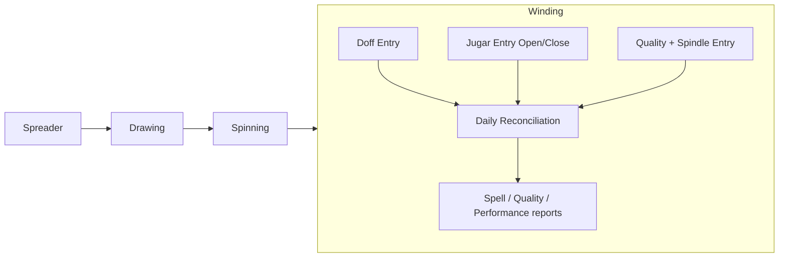

# VoWERP3 Winding Production — Design & Logic Specification

**Date:** 2026-06-13
**Status:** Documentation only — no implementation yet (design handoff)
**Module:** Jute Production (new sub-section: **Winding**)
**Proposed router prefixes:** `/api/windingProd`, `/api/windingMasters`
**Proposed table prefix:** `jute_prod_winding_`

> ## ⚠️ STATUS UPDATE (2026-07-30) — see `docs/winding-person-keyed-entry-spec.md`
>
> Winding production **shipped** since this design handoff — machine-keyed, largely per §6 below
> (`src/juteProduction/winding_entry.py`, `winding_query.py`, `winding_models.py`). Two supersessions
> since then:
>
> - **§6** (the proposed machine-keyed target design) became the actual implementation, then was
>   superseded as the quality-mapping authority by `docs/winding-quality-reference-spec.md`
>   (2026-07-27, Helper + Mapper + Sync) — which is itself now superseded, see the next point.
> - **§4** (the net-split / combined-doff math — one weighing divided across 1–3 machines) is
>   **SUPERSEDED** by the locked design change in `docs/winding-person-keyed-entry-spec.md`
>   (2026-07-30): a doff becomes **one weighing by one person** (EB no) — no machine on the row, no
>   split, no `no_of_machines`. Read that spec first; it is the current source of truth for entry.
>
> This file remains the reference for the **legacy code3i behaviour and formulas** (§1–§3, §5, §8) —
> those did not change. Passages that now describe superseded/dead behaviour are annotated inline
> below rather than removed, since this is still the historical record of how winding got here.

---

## 1. Purpose & Position in the Jute Chain

Winding is the mill-floor stage **after spinning**: spun jute yarn (cops/spindles produced by
spinning frames) is wound onto trollies/spools. Operators weigh each wound trolly ("doff"), record
the leftover spindle weight at shift open/close ("jugar"), and tag each machine/shift with the yarn
**quality** and **spindle count**. Daily production per machine/operator is then reconciled from
doff weight adjusted by the jugar opening/closing balance, costed against a per-quality target, and
rolled up for payroll/efficiency reporting.



This document records the **legacy CodeIgniter system AS-IS** (source of truth for behaviour),
then proposes a **vowerp3-native target design** mirroring the existing spreader/drawing/spinning
conventions. **Nothing here is implemented yet** — no migrations, ORM, routers, or pages.

---

## 2. Legacy System Map (code3i)

Legacy app: `c:\code\code3i` (CodeIgniter, MySQL schema `EMPMILL12`, multi-company via `company_id`).

| Layer | File |
|-------|------|
| View — Doff Entry | `application/views/admin/winding_doff/winding_doff_data.php` |
| View — Jugar Entry | `application/views/admin/winding_doff/winding_jugar_entry.php` |
| View — Quality Entry | `application/views/admin/winding_doff/winding_quality_entry.php` |
| Controller — Doff + Jugar | `application/controllers/admin/Winding_doff_data.php` |
| Controller — Jugar (variant) | `application/controllers/admin/Winding_jugar_entry.php` |
| Controller — Quality | `application/controllers/admin/Winding_quality_entry.php` |
| Model — all winding SQL | `application/models/Winding_doff_Model.php` |
| Reports controllers | `application/controllers/admin/reports/Winding_data_reports.php`, `Winding_performance_report.php`, `Winding_quality_wise_report.php`, `Winding_duplicate_mc_checking.php` |

### 2.1 Legacy tables (`EMPMILL12`)

| Table | Role | Key columns (verified from model/controller SQL) |
|-------|------|---------------------------------------------------|
| `WINDING_SPELL_EB_PROD_QLTY` | Doff production — **one row per machine per doff** | `auto_id` PK, `rec_date`, `spell`, `quality_id`, `production` (net wt/mc), `prod_kgs` (gross input), `gross_wt` (per-mc net+trolly+spool), `wnd_mc_id`, `trolly_id`, `trolly_wt`, `spool_id`, `spool_wt`, `no_mcs`, `eb_id` (operator, back-filled), `entry_date`, `update_ip`, `company_id`, `is_active` |
| `WINDING_JUGAR_ENTRY` | Spindle open/close leftover weight per machine/spell | `auto_id` PK, `tran_date`, `spell`, `weight`, `wnd_mc_id`, `open_close` (`'O'`/`'C'`), `entry_date`, `update_ip`, `company_id`, `is_active` |
| `WINDING_DAILY_SPELL_EB` | Quality + spindle count per machine/spell | `auto_id` PK, `tran_date`, `spell`, `wnd_mc_id`, `quality_id`, `no_of_spindle`, `created_by`, `update_ip`, `company_id`, `is_active` |
| `WINDING_QUALITY_MASTER` | Winding quality codes | `wnd_quality_id` PK, `WND_Q_CODE`, `QUALITY`, `TARGET_PROD` (per 8-hr), `UOM` (`'B'`=bundles else kg), `WND_GR_CODE`, `company_id` |
| `WINDING_GROUP_MASTER` | Quality grouping for summaries | `WND_GR_CODE`, `WND_GROUP_NAME` |
| `trollymst` | Shared trolly **and** spool master | `trollyid` PK, `trollyno`, `trolly_weight`, `trolly_details`, `process_type` (**39 = trolly, 101 = spool**), `company_id` |
| `mechine_master` | Machine master | `mechine_id` PK, `mechine_name`, `mech_code`, `mach_shr_code`, `type_of_mechine` (**39 = winding**), `dept_id` (**53 = winding dept**), `company_id` |
| `daily_ebmc_attendance` / `daily_attendance` | Operator–machine attendance + worked/idle hours (HR) | `mc_id`, `eb_id`, `eb_no`, `attendace_date` *(sic)*, `spell`, `working_hours`, `idle_hours`, `is_active` |
| `view_winding_all_data`, `allwindingdata`, `spellwindingdata`, `view_proc_spellwindingdata`, `view_winding_qualitywise_data` | Reporting views (production reconciled with jugar + attendance + quality) | see §5 |

> Spelling note: legacy column is `attendace_date` (typo) and machine table is `mechine_master`
> (typo). These mirror the production-typo policy in `CLAUDE.md` — **do not "fix"** when reading
> legacy; pick correct spellings for new vowerp3 tables.

---

## 3. Logical Flow per Screen

All three screens share a header of **Date + Spell** and a **winding machine** picker. Spell is
auto-selected by current hour (client JS): `00–06 → C` (and date set to yesterday), `>22 → C`,
`06–11 → A1`, `11–14 → B1`, `14–17 → A2`, `17–22 → B2`. Dates are entered `dd-mm-yyyy` and converted
to `yyyy-mm-dd` server-side before insert (`Winding_doff_data.php:348`).

### 3.1 Doff Entry (`winding_doff_data.php` + `Winding_doff_data.php`)

Records a wound-trolly weighing. One doff can cover **1–3 machines** sharing the same trolly + spool
(`nomcs` ∈ {1,2,3}).

| Step | Trigger | Endpoint → model | Effect |
|------|---------|------------------|--------|
| Pick MC #1 | `#mc_no1` change | `mcno1_data` → `getwndprvDoffData` | Pre-fills trolly/spool/quality/weights from that machine's **last** doff (`MAX(auto_id)` where `is_active=1`) |
| Pick MC #2/#3 | change | `mcno2_data` → `getwndmc2Data` | Validates the extra machine exists (`mach_shr_code`) |
| Enter Trolly No | blur | `trolly_data` → `getwndtrollyData` | Looks up `trolly_weight` (`process_type=39`), resets gross/net |
| Pick Spool | change | `spool_data` → `getwndspoolData` | Looks up spool `trolly_weight` (`process_type=101`) |
| Enter Gross Wt | input | *client-side* | Computes net + per-machine split (see §4.1) |
| Save | click | `savewnddoff_data` | Inserts 1–3 rows into `WINDING_SPELL_EB_PROD_QLTY` |
| List | load / filter change | `get_records` → `getwndDoffdata` | Deactivates duplicates, then lists the day/spell/mc rows |
| Delete | row button | `deleteRecord` | Soft delete (`is_active=0`) |

**Saved row** (`savewnddoff_data:373-441`, repeated per active machine):
`rec_date, spell, quality_id, production = mcXnetwt, prod_kgs = grosswt, gross_wt = mcXnetwt + trollywt + spoolwt,
wnd_mc_id = mcnoX, trolly_id, trolly_wt, spool_id, spool_wt, no_mcs, entry_date = now, update_ip, company_id, is_active = 1`.

**Validations** (view): trolly required (`trollyid > 0`), MC#1 required, MC#2 required if `nomcs≥2`,
MC#3 if `nomcs=3`, spool & quality required, `grosswt > 0`, `1 ≤ mc1netwt ≤ 500`.

### 3.2 Jugar Entry (`winding_jugar_entry.php` + `Winding_doff_data.php`)

"Jugar" = the yarn weight still on spindles at shift boundary. Each machine/spell gets an **Opening
('O')** and a **Closing ('C')** jugar so production can be corrected for carryover (yarn started but
not yet doffed). Validation: `0 < jugarwt ≤ 100`.

| Step | Trigger | Endpoint → model | Effect |
|------|---------|------------------|--------|
| Pick MC (current) | change | `mcno1_jugardata` → `getjugarData` | Blocks duplicate jugar for date/shift/mc/openclose |
| Pick MC (prev ref) | change | `jugmcno1_data` → `getwndprvjugarData` | Carry-forward lookup (see below); returns `weight` + `autoid` → toggles Save vs Update |
| Save | click | `savejugdoff_data` | Insert into `WINDING_JUGAR_ENTRY` |
| Update | click | `updatejugdoff_data` | `UPDATE … SET weight WHERE auto_id = record_id` |
| List | load / filter | `get_jugarrecords` → `getjugDoffdata` | Deactivate duplicates, then list |

**Carry-forward logic** (`getwndprvjugarData`, model:88-118) — full detail:
- **Opening ('O')** for the current date/spell first looks for an existing opening jugar matching
  the chosen prior date/spell (`open_close='O'`, `tran_date = windingcDate`, `spell = shiftcname`,
  `rem='OE'`). If none, it falls back to the **most recent prior closing** jugar
  (`open_close='C'`, `tran_date < windingDate`, `ORDER BY auto_id DESC LIMIT 1`, `rem='ON'`) — i.e.
  this shift's opening = last shift's closing leftover.
- **Closing ('C')** looks for the matching prior closing jugar (`open_close='C'`,
  `tran_date = windingcDate`, `spell = shiftcname`, `rem='CE'`).

**Saved row** (`savejugdoff_data:472-483`):
`tran_date, spell, weight = jugarwt, wnd_mc_id, open_close, entry_date = now, update_ip, company_id, is_active = 1`.

### 3.3 Quality Entry (`winding_quality_entry.php` + `Winding_quality_entry.php`)

Assigns the yarn **quality** and **no. of spindles** running on each machine for a date/spell. This
feeds both the production reconciliation (quality drives UOM + target) and the back-fill of
`quality_id` onto doff rows.

| Step | Trigger | Endpoint → model | Effect |
|------|---------|------------------|--------|
| Get Quality | click | `getwndqcode_data` → `getwndqcData` | If no rows for date/spell, **auto-seeds** one row per winding machine, inheriting the previous spell's `quality_id` + `no_of_spindle` |
| Pick MC | change | `mcno1_checkdata` → `mcno1_checkdata` | Blocks duplicate quality entry per machine/date/spell |
| Save | click | `savewndqc_data` | `UPDATE WINDING_DAILY_SPELL_EB SET quality_id, wnd_mc_id, no_of_spindle WHERE auto_id = record_id` |
| List | load / filter | `get_wndqcrecords` → `getwndqcrecorddata` | Lists machines + quality + spindle for date/spell |

**Auto-seed** (`getwndqcData`, model:382-485): finds `MAX(tran_date) ≤ doffdate`, then the highest
spell on that date, and `INSERT … SELECT` from `mechine_master` (`type_of_mechine=39`) LEFT JOIN the
previous `WINDING_DAILY_SPELL_EB` to carry forward `quality_id`/`no_of_spindle` (defaulting 0).

**Validation:** view requires `1 ≤ nospool ≤ 30` though the alert text says "1 to 16" — **flag as an
inconsistency** to resolve in the new design.

---

## 4. Formulas (verified)

> **Status:** these are the **legacy code3i formulas**, verified from `winding_doff_data.php` — kept
> as the historical record. **§4.1's per-machine split is SUPERSEDED**: the locked design
> (`docs/winding-person-keyed-entry-spec.md` §5) drops the machine and the split entirely —
> `net = gross − trolly − spool`, one weighing, one person, one row. §4.2's reconciliation formula
> shape (`Σ production − opening + closing`) is unchanged; only its grouping key moves from
> `machine_id` to the person (`eb_id`) — see that spec's §6. §4.3's target/efficiency formulas and
> §4.4/§4.5 (legacy back-fill, de-dup) are unaffected by the person-keyed change.

### 4.1 Doff net weight + per-machine split (`winding_doff_data.php:683-745`) — ⚠️ SUPERSEDED, see above

```text
netwt        = grosswt − trollywt − (nomc × spoolwt)        # GATE: must be > 0 to enable Save
trolly/mc    = round2(trollywt / nomc)
gross/mc     = round2(grosswt / nomc)
net/mc (wt)  = round( gross/mc − trolly/mc − spoolwt )       # integer; SAME value to each active mc
```
- The same `net/mc` is written to every active machine's `production`; mc2/mc3 get `0` when not used.
- Stored per row: `gross_wt(mc) = net/mc + trollywt + spoolwt` (`savewnddoff_data:362-364`).
- `prod_kgs` = the **total** gross input (same on every row of the doff).

> Modelling note: the legacy split is an **equal division** of one combined weighing across the
> machines that shared the trolly — it does **not** measure each machine individually.

### 4.2 Daily production reconciliation (`getfinishalldata` / `view_winding_all_data`, model:632-667)

This is the **actual production** number used by every report:

```text
production_kg = Σ(doff.production)  −  opening_jugar  +  closing_jugar          # per machine/spell/quality
              = Σ(prod − opwt + clwt)
production    = (UOM = 'B') ? round(production_kg / 14, 0)    # kg → bundles (14 kg/bundle)
                           : production_kg                     # kg as-is
```
where `opwt = MAX(weight WHERE open_close='O')`, `clwt = MAX(weight WHERE open_close='C')` per
`tran_date, spell, wnd_mc_id` (model:644-650). Subtracting opening and adding closing converts
"weight doffed this shift" into "weight actually produced this shift" net of spindle carryover.

> **Gap flagged:** the legacy *data-entry* path stores only `production` (doff net). The
> jugar adjustment is applied **only at report time** via the views — there is **no persisted
> reconciled-production or variance column**. The new design should decide whether to persist the
> reconciled value or keep it computed (recommended: compute, mirroring spreader/drawing reports).

### 4.3 Target, efficiency, averages (reporting views)

```text
target_prod   = WINDING_QUALITY_MASTER.TARGET_PROD / 8 × (working_hours − idle_hours)   # per row
efficiency %  = round( Σ(prod) / Σ(target_prod) × 100, 2 )
avg_prod_8hr  = round( Σ(prod) / Σ(att_hours) × 8, 0 )
prod_per_8hr  = round( Σ(prod) / Σ(work_hours) × 8, 0 )      # performance report
shift_bucket  = substr(spell, 1, 1)                          # A1,A2→A ; B1,B2→B ; C→C
```
(`get_wndindreprecords` model:711-742, `get_wndperrecords` model:744-772.) Quality-wise summary
buckets employees/production/target into A/B/C columns (`empla/emplb/emplc`, `topdka/b/c`,
`totrga/b/c`) grouped by `WND_Q_CODE` (model:799-882) and by spinning group (model:886-940).

### 4.4 Post-entry back-fill (`get_wnduprecords`, model:294-367)

A maintenance pass (legacy ties production to HR attendance after the fact):
- `UPDATE WINDING_SPELL_EB_PROD_QLTY.quality_id` ← matching `WINDING_DAILY_SPELL_EB` (by mc/spell/date).
- `UPDATE WINDING_SPELL_EB_PROD_QLTY.eb_id` ← `daily_ebmc_attendance.eb_id` (operator who ran the mc).
- Duplicate detector returns machines with >1 production group per spell (data-quality guard).

### 4.5 De-duplication (both doff & jugar lists)

Before listing, the model deactivates duplicate rows keeping the latest:
`getwndDoffdata` (model:524-536) sets `is_active=0` for the `MAX(auto_id)` of any
company/date/spell/entry_date/mc group with `COUNT(*)>1`; `getjugDoffdata` (model:592-612) does the
same per date/spell/openclose/mc.

---

## 5. Data Points Collected (field catalog)

| Screen | Input fields | Derived (client) | Stored columns |
|--------|--------------|-------------------|----------------|
| **Doff** | date, spell, no-of-mcs, mc1/mc2/mc3, trolly no, spool code, quality, gross wt | trolly wt, spool wt (lookups); net/mc, gross/mc | `WINDING_SPELL_EB_PROD_QLTY`: rec_date, spell, quality_id, production, prod_kgs, gross_wt, wnd_mc_id, trolly_id, trolly_wt, spool_id, spool_wt, no_mcs, entry_date, update_ip, company_id, is_active (+ eb_id back-filled) |
| **Jugar** | date, spell, mc, open/close, jugar wt; (prev date/spell for carry-forward) | carry-forward weight (lookup) | `WINDING_JUGAR_ENTRY`: tran_date, spell, weight, wnd_mc_id, open_close, entry_date, update_ip, company_id, is_active |
| **Quality** | date, spell, mc, quality, no-of-spindle | — | `WINDING_DAILY_SPELL_EB`: tran_date, spell, wnd_mc_id, quality_id, no_of_spindle, created_by, update_ip, company_id, is_active |

Masters consumed (read-only): `mechine_master` (winding machines), `trollymst` (trolly + spool),
`WINDING_QUALITY_MASTER`, plus HR `daily_ebmc_attendance` / `daily_attendance` for operator linkage.

---

## 6. Proposed VoWERP3-Native Target Design

> **Status:** this proposal **shipped** machine-keyed (tables, routers, and the `operator_id`
> column below all match the built `jute_prod_winding_*` tables and `winding_entry.py`), but the
> `machine_id` / `no_of_machines` / `operator_id` shape it describes is now **superseded** by
> `docs/winding-person-keyed-entry-spec.md` §3 (machine dropped from the doff row entirely;
> `operator_id` renamed `eb_id` and becomes the entry key, not an optional attendance back-fill).
> Endpoint *names* in §6.2 were also never the ones actually shipped — see
> `../vowerp3ui/docs/claude/modules/jute-production/backend-map.md` for the real names and their
> person-keyed successors.

Mirror the existing jute-production sub-sections (spreader/drawing/spinning): Portal persona,
`Depends(get_tenant_db)` + `get_current_user_with_refresh`, `{"data": …}` responses, **no approval
workflow**, soft delete (`active = 0`), every table scoped by `co_id` (+ `branch_id`).

### 6.1 Proposed tables (`jute_prod_winding_`)

| New table | Replaces legacy | Notes |
|-----------|-----------------|-------|
| `jute_prod_winding_doff` | `WINDING_SPELL_EB_PROD_QLTY` | one row per machine per doff; columns below |
| `jute_prod_winding_jugar` | `WINDING_JUGAR_ENTRY` | `open_close` CHAR(1); unique (co_id, branch_id, tran_date, spell, machine_id, open_close) active |
| `jute_prod_winding_daily_qlty` | `WINDING_DAILY_SPELL_EB` | quality + spindle per machine/spell |
| `jute_prod_winding_machine_attr` | (new) | per-machine winding attrs (mirrors `*_machine_attr`); optional default spool, capacity |
| *reuse* `trolly_mst` | `trollymst` (process_type 39/101) | reuse the spinning-masters `trolly_mst`; distinguish trolly vs spool by a type column |
| *reuse* a winding quality master | `WINDING_QUALITY_MASTER` | decide: extend `yarn_quality_param` or add `jute_prod_winding_quality_mst` (carries `target_prod`, `uom`, group) |

**Legacy → proposed column map (doff):**

| Legacy (`WINDING_SPELL_EB_PROD_QLTY`) | Proposed (`jute_prod_winding_doff`) |
|---|---|
| `auto_id` | `winding_doff_id` PK |
| `rec_date` | `tran_date` |
| `spell` | `spell` |
| `quality_id` | `quality_id` FK |
| `production` | `production_qty` (net wt/mc) |
| `prod_kgs` | `gross_input_wt` (total doff gross) |
| `gross_wt` | `row_gross_wt` (net+trolly+spool per mc) |
| `wnd_mc_id` | `machine_id` FK |
| `trolly_id` / `trolly_wt` | `trolly_id` / `trolly_wt` |
| `spool_id` / `spool_wt` | `spool_id` / `spool_wt` |
| `no_mcs` | `no_of_machines` |
| `eb_id` | `operator_id` (optional; via attendance) |
| `company_id` | `co_id` (+ add `branch_id`) |
| `is_active` | `active` |
| `entry_date` / `update_ip` | drop — audit via DB triggers (per CLAUDE.md) |

### 6.2 Proposed routers & endpoints

Register in `src/main.py` next to the spinning routers (after `:197`).

| New router | Prefix | Endpoints (mirroring spreader/drawing) |
|-----------|--------|-----------------------------------------|
| `src/juteProduction/winding_entry.py` | `/api/windingProd` | **Doff:** `doff_entry_create_setup`, `doff_machine_prev_state`, `doff_entry_create`, `doff_entries_by_date`, `doff_entry_edit/{id}`, `doff_entry_delete/{id}`. **Jugar:** `jugar_setup`, `jugar_prev_state` (carry-forward), `jugar_save`, `jugar_update/{id}`, `jugar_by_date`. **Quality:** `quality_setup` (auto-seed), `quality_save`, `quality_by_date` |
| `src/juteProduction/winding_masters.py` | `/api/windingMasters` | `winding_machine_attr_{list,create,edit/{id}}`; winding quality master CRUD (if not folded into yarn quality) |
| (extend) `src/juteProduction/reports.py` | `/api/juteProductionReports` | `winding_spell_report`, `winding_quality_wise`, `winding_performance`, `winding_individual` — apply §4.2–4.3 formulas |

Supporting files (mirror existing): `winding_query.py` (SQL), `services/winding_rules.py`
(net-split, jugar carry-forward, reconciliation), additions to `constants.py`
(`WINDING_MACHINE_TYPE`, `BUNDLE_KG = 14`, `SPINDLE_MIN/MAX`, net-weight bounds).

### 6.3 Proposed frontend

New `src/app/dashboardportal/juteProduction/winding/page.tsx` with **three tabs** mirroring the
spreader page: **Doff** / **Jugar** / **Quality**, plus a masters page
`masters/windingMachineAttr/`. Client `utils/windingCalc.ts` mirrors `services/winding_rules.py`
(net-split + reconciliation) exactly, as `drawingCalc.ts` mirrors `drawing_rules.py`. Add a landing
tile in `juteProduction/page.tsx`. Detail catalog in
`../vowerp3ui/docs/claude/modules/jute-production/`.

---

## 7. Open Questions / Gaps to Resolve Before Implementation

1. **Reconciled production** — persist `production − opwt + clwt` on save, or compute at report time
   (recommended)? Legacy computes it only in views (§4.2).
2. **Quality master** — reuse/extend `yarn_quality_param`, or add a dedicated winding quality master
   carrying `target_prod` + `uom` + group? Legacy uses a separate `WINDING_QUALITY_MASTER`.
3. **Trolly vs spool** — legacy overloads `trollymst.process_type` (39 vs 101). In vowerp3 reuse
   `trolly_mst` with an explicit type column.
4. **Bundle factor 14** — confirm `/14` kg→bundle divisor is correct for all tenants or
   make it a quality/UOM-driven master value.
5. **Spindle bounds** — resolve the legacy 1–30 vs "1–16" inconsistency (§3.3).
6. **Operator linkage** — vowerp3 has no `daily_ebmc_attendance` equivalent wired into production
   yet; decide how (or whether) winding production ties to HRMS attendance for performance reports.
   **RESOLVED 2026-07-30** (`docs/winding-person-keyed-entry-spec.md` D1): the worker list comes
   from HRMS masters (`hrms_ed_official_details` + `hrms_ed_personal_details`), **not** attendance —
   entry must not depend on attendance being synced.
7. **Per-machine measurement** — legacy splits one combined weighing equally across 1–3 machines.
   Confirm whether the new design keeps the combined-doff model or captures per-machine weights.
   **RESOLVED 2026-07-30** (same spec, D3/D4): neither — the combined-doff/split model is dropped.
   A doff is one weighing by one person; no machine, no split.
8. **Legacy bugs not to carry over:** hardcoded `company_id=2` in the quality auto-seed subquery
   (`Winding_doff_Model.php:451`) and hardcoded `created_by=26586` (`:416`) — must be parameterised.

---

## 8. References

- Legacy source: see §2 table (code3i views/controllers/model).
- VoWERP3 conventions: `src/juteProduction/` (spreader/drawing/spinning), `src/main.py:186-197`,
  `CLAUDE.md` (persona/DB/response/typo rules).
- Frontend catalog: `../vowerp3ui/docs/claude/modules/jute-production/` and the
  `module-jute-production` agent in both repos.
