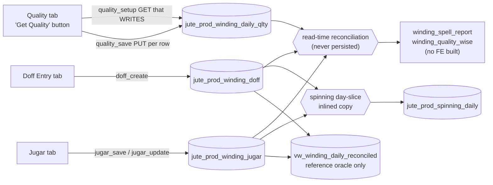

# Winding — Quality Reference Table & Doff Stamping Spec Sheet

**Scope:** Winding production (doff entry → quality reference map → jugar → reconciliation → reports), the tables every step posts to, the **reference table that supplies quality automatically until changed** and the retro-update that pushes a change onto the main winding entry table, mid-shift quality changes, exception handling, the reconciliation defects found during this audit, and the vowsls legacy import.

**Companion spec:** `docs/spinning-doff-attendance-quality-spec.md` §5 — winding reuses that Helper + Mapper architecture verbatim. Read it first; this document records only what differs and what winding-specific reality demands.

**Supersedes:** `docs/winding-production-design.md` (2026-06-13) §6 as the quality-mapping authority. That document remains the reference for legacy code3i behaviour and the formulas; winding is now **built**, so its "proposed design" section is history.

**Evidence base:** code recon of both repos + live column-usage profiling of `dev3`, `sls`, and `vowsls` (2026-07-27).

> **⚠️ SUPERSEDED IN PART (2026-07-30) — see `docs/winding-person-keyed-entry-spec.md`.** The user
> locked a different design: winding moves from *machine*-keyed to *person*-keyed (EB no) entry.
> Two casualties here:
> - **§5** (the machine→quality Helper + Mapper + Sync architecture — new tables
>   `wdg_quality_helper` / `wdg_quality_mapper`, `quality_map_save`, `doff_sync`) is **dropped
>   entirely**, not just re-keyed. The new spec re-keys the *existing*
>   `jute_prod_winding_daily_qlty` table to `eb_id` instead — no new tables, no mapper log, no
>   retro-update engine. One mental model was traded for a simpler one because the entry key
>   itself changed underneath it.
> - **§10 D5** (and the operator-sync discussion in §5.4) — "stay import-only for `operator_id`"
>   is superseded: `operator_id` is renamed `eb_id` and becomes the **mandatory entry key**,
>   clerk-picked from an HRMS-sourced worker list (`hrms_ed_official_details` +
>   `hrms_ed_personal_details`) at doff time — not attendance-derived, not import-only.
>
> §1–§2, §4, §7–§9 (process flow, table posting map, verified defects, legacy import) are **audit
> evidence and still valid** — read them alongside the new spec, not instead of it. §3 (column
> audit) and §6 (exception matrix) are annotated inline below where the person-keyed reality
> changes their reading.

---

## 0. The one-paragraph version

Winding already has a quality reference table — `jute_prod_winding_daily_qlty` — which auto-seeds one row per machine per date/spell, carrying forward the previous spell's yarn and spindle count. It does not work: it is **12% populated** in dev3 (3 of 25 rows carry an `item_id`), because the carry-forward has nothing to bootstrap from and propagates NULL forever. Worse, it is a **parallel** source of truth: the doff row carries its own client-typed `item_id` (100% populated), the winding reports read the reference table's `item_id`, and spinning's day-slice reads the doff row's `item_id` — the same reconciliation formula, keyed on two different qualities, producing two different answers for the same kilograms. This spec replaces the per-date/spell snapshot with the spinning pattern: a **helper** (one row per machine = "what is this machine winding right now") plus an append-only **mapper** (the change log that owns history and drives retro-updates), the doff row stamped at insert from the helper, and the doff row as the single source of truth for every reader.

---

## 1. Current process — end-to-end flow



Three readers of the same reconciliation formula. **They do not agree** — see §4 G1/G2/G9.

### 1.1 Pages

| Page | Path (FE) | Tabs / sections |
|---|---|---|
| Winding Production | `../vowerp3ui/src/app/dashboardportal/juteProduction/winding/page.tsx` | Doff Entry, Jugar, Quality — MUI `Tabs` on ONE route, shared Date + Spell selectors (mirrors the spinning page) |
| Winding reports | **does not exist** | `WINDING_SPELL_REPORT` / `WINDING_QUALITY_WISE_REPORT` are defined in `src/utils/api.ts` with zero callers |

Supporting FE: `_components/{DoffForm,DoffGrid,JugarForm,JugarGrid,QualityGrid}.tsx`, hooks `use{WindingDoffSetup,WindingDoffPrevState,DoffByDate,JugarSetup,JugarPrevState,JugarByDate,QualitySetup,QualityByDate}.ts`, `utils/windingCalc.ts` (mirrors `services/winding_rules.py`).

### 1.2 API inventory — endpoint → handler → **table posted to**

Prefix `/api/windingProd` (router `src/juteProduction/winding_entry.py`, registered `src/main.py:270`):

| Method + path | Handler (file:line) | What it does | Posts to |
|---|---|---|---|
| GET `/doff_setup` | winding_entry.py:220 | Winding machines, yarn items, trollies (`trolly_type='T'`), spools (`'S'`), spells | read-only |
| GET `/doff_machine_prev_state` | winding_entry.py:323 | Echoes MC#1's **last active doff** (item, trolly, spool, weights) as a form prefill | read-only |
| POST `/doff_create` | winding_entry.py:369 | Combined 1–3 machine weighing; equal split; validates total net > 0 and per-machine net ∈ [1, 500] kg; branch derived from `machine_ids[0]` when omitted | **`jute_prod_winding_doff`** INSERT × nomc (`item_id ← body.quality_id`, same `production_qty` on every row) |
| GET `/doff_by_date` | winding_entry.py:456 | Day grid | read-only |
| PUT `/doff_edit/{id}` | winding_entry.py:506 | Recomputes the row **as nomc=1** (§7.2) | **`jute_prod_winding_doff`** UPDATE |
| DELETE `/doff_delete/{id}` | winding_entry.py:587 | Soft delete | `active=0` |
| GET `/jugar_setup` | winding_entry.py:620 | Machines + spells | read-only |
| GET `/jugar_prev_state` | winding_entry.py:670 | Carry-forward lookup + existing-row probe (drives Save vs Update) | read-only |
| POST `/jugar_save` | winding_entry.py:763 | Dup-guarded on (co, date, spell, machine, open_close) | **`jute_prod_winding_jugar`** INSERT |
| PUT `/jugar_update/{id}` | winding_entry.py:820 | Weight only | UPDATE |
| GET `/jugar_by_date` | winding_entry.py:851 | Day grid | read-only |
| GET `/quality_setup` | winding_entry.py:899 | ⚠️ **A GET that WRITES** — auto-seeds one row per winding machine for (date, spell), inheriting the previous spell's `item_id` + `no_of_spindle`, then lists | **`jute_prod_winding_daily_qlty`** INSERT…SELECT |
| PUT `/quality_save/{id}` | winding_entry.py:985 | Sets `item_id` + `no_of_spindle`; dup-guarded per (co, date, spell, machine) | UPDATE |
| GET `/quality_by_date` | winding_entry.py:1038 | Day grid | read-only |

Prefix `/api/juteProductionReports` (`winding_reports.py`, registered `src/main.py:284`): `winding_spell_report` (:87), `winding_quality_wise` (:155). Both carry an explicit `LIMITATION_NOTE` (winding_reports.py:42-46) — **production KG only**, no target/efficiency/bundle math, because no winding target master and no attendance link exist. Neither has a frontend.

### 1.3 Where calculated data is computed and persisted

- **Net split** — computed server-side at `doff_create` (`compute_winding_net` / `compute_winding_net_per_mc` / `compute_winding_row_gross_wt`, `services/winding_rules.py`); persisted frozen on each doff row. The same `net_per_mc` is written to every machine of the doff (legacy-faithful equal division, not a per-machine measurement).
- **Reconciled production** — `SUM(production_qty) − opening_jugar + closing_jugar` — computed **on read only, never persisted**. Stated in three docstrings (`winding_entry.py:22-24`, `winding_query.py:17-18`, `winding_rules.py:67-77`) and settled as open-question #1 of the 2026-06-13 design doc.
- **No Process / freeze / lock exists for winding** — no `winding_lock.py`, no `winding_process.py`, no `jute_prod_winding_daily`. Spinning and weaving both have all three. This is deliberate and stays that way (§5.6, D11).

---

## 2. Table posting map (master reference)

| Table | Written by | When | Grain / key |
|---|---|---|---|
| `jute_prod_winding_doff` | `doff_create` / `doff_edit` / `doff_delete`; **legacy import** | every weighing | one row per **machine per doff**; no DB unique key, **no app dedup guard either** (G4) |
| `jute_prod_winding_jugar` | `jugar_save` / `jugar_update` | shift open + close | one active row per (co, date, spell, machine, open_close) — app-enforced |
| `jute_prod_winding_daily_qlty` | `quality_setup` auto-seed, `quality_save` | on "Get Quality" click, then per-row save | one active row per (co, date, spell, machine) — app-enforced |
| `wdg_quality_helper` **(new)** | mapper-save code path only | on a lasting quality/spindle change | one row per `mc_id` (UNIQUE) |
| `wdg_quality_mapper` **(new)** | `quality_map_save` | on a lasting change | append-only change log |
| `vw_winding_daily_reconciled` | — (view) | — | reference/diff oracle; **explicitly forbidden on request paths** by its own migration comment |

Masters read (not owned): `machine_mst` + `machine_type_mst` (`machine_type_name = 'Winding'`) + `dept_mst` (branch spine — `machine_mst` has **no** `branch_id`), `trolly_mst` (`trolly_type` 'T'/'S' distinguishes trolly from spool), `item_mst` / `jute_yarn_mst` (yarn identity — **there is no winding quality master**; quality *is* the yarn item), `spell_mst`.

---

## 3. Column audit — live data (dev3 / sls / vowsls, 2026-07-27)

### 3.1 Row counts

| Table | dev3 | sls |
|---|---|---|
| `jute_prod_winding_doff` | 19 | **0** |
| `jute_prod_winding_jugar` | 8 | **0** |
| `jute_prod_winding_daily_qlty` | 25 | **0** |
| `vw_winding_daily_reconciled` | 14 | 0 |
| `daily_doff_frames_winding` (`spg_wdg='W'`) | **0** | **0** |

sls carries the winding tables **structure-only** — winding has never been used there. dev3 is the only DB with live winding rows. Machine spine: dev3 has **4** winding machines (`machine_type_id` 10 'Winding', all branch 2); sls has **218** (`machine_type_id` 39 'Winding' — branch 29: 178, branch 4: 20, branch 87: 20). sls also carries empty `Cop Winding` (47) and `Spool Winding` (48) types with zero machines.

### 3.2 `jute_prod_winding_doff` (dev3, 19 rows)

| Column | Verdict | Evidence / action |
|---|---|---|
| `item_id` | **100% populated** (19/19, 4 distinct) | typed by the clerk on the Doff form. ~~Becomes helper/mapper-stamped in §5~~ — superseded; stamping direction now per §5.2 of the person-keyed spec (helper concept dropped, item still typed/prefilled on the doff form) |
| `operator_id` | **DEAD** — 0 non-null | no FE field, no attendance derivation, client-supplied only. See G6. **Superseded 2026-07-30:** renamed `eb_id`, becomes the mandatory entry key (`docs/winding-person-keyed-entry-spec.md` D1/D3) — will go from 0% to 100% populated going forward |
| `no_of_machines` | active (2 distinct) | combined doffs were real. **Superseded 2026-07-30:** dropped from person-keyed entry — becomes NULL-able and unwritten going forward (D3/D4); the rows that carried it were hard-deleted the same day (see note below), not kept as legacy |
| `trolly_wt` / `spool_wt` | populated (spool non-zero 16/19) | 3 rows with `spool_wt` 0 — verify those are genuine spool-less doffs, not a lookup miss |
| everything else | active | — |

> All of the above is audit evidence from the live dev3 data as of 2026-07-27 and stays valid as a
> record of the machine-keyed period. **Updated 2026-07-30:** these 19 rows (dev3's only winding
> doff rows; sls had none) were hard-deleted when `winding_person_keyed_entry.sql` landed on both
> dev3 and sls — D6 was revised from "keep as legacy" to "delete, do not backfill"
> (`docs/winding-person-keyed-entry-spec.md` D6). There is no longer a two-row-shape concern: both
> tenants now carry the new schema with zero winding rows. Reads still LEFT JOIN the worker, but
> defensively — for an `eb_id` whose HRMS row is missing or inactive — not to tolerate legacy rows,
> which no longer exist.

### 3.3 `jute_prod_winding_daily_qlty` (dev3, 25 rows) — the reference table today

| Column | Verdict |
|---|---|
| `item_id` | **3 / 25 populated (12%)** — the carry-forward propagates NULL. This is the core failure (G3) |
| `no_of_spindle` | 25 non-null but only **3 non-zero** — same NULL/0 propagation |
| all others | populated |

> **Reconciled with the person-keyed reality (2026-07-30):** this table is not replaced, it is
> **re-keyed**. `docs/winding-person-keyed-entry-spec.md` §3 adds `eb_id` to this same table (machine
> becomes NULL-able) and its `quality_setup` auto-seeds one row **per person carried forward from
> the previous spell** — the identical bootstrap-gap risk (G3) in a new key: with no prior spell for
> that person, it seeds nothing rather than a NULL row (an improvement — see that spec's §4.2 on
> `GET /quality_setup`). The fix is no longer the Helper + Mapper architecture of §5 above; it is a
> direct re-key of this table plus `POST /quality_add` / `DELETE /quality_delete/{id}` for winders
> who join or drop off the day's map.
>
> **Update 2026-07-30:** all 25 rows above were hard-deleted along with the doff and jugar rows when
> the migration landed — not kept as legacy. The table is now empty in both dev3 and sls, carrying
> the new `eb_id` column, and will be repopulated by the per-person auto-seed described above going
> forward.

### 3.4 `daily_doff_frames_winding` — not winding's table

Despite the name, this belongs to **spinning**'s frame→quality map (`spg_wdg='S'`) and a legacy mobile-app feature. **Zero `'W'` rows exist in dev3 or sls** (118 S rows in dev3, 45 in sls). Its winding-payload columns (`quality_id`, `eb_id`, `sc_type`, `trolly_id`, `gross_weight`, `tare_weight`, `net_weight`, `user_id`) are 100% dead in both DBs. **Winding must never write here** — the spinning spec reaches the same conclusion from the other side (its §8.3 / D5).

### 3.5 vowsls `winding_doff_entry` (legacy, **still live**)

329,832 rows; `created_date` range **2019-04-03 → 2026-07-27 18:07** — writing *today*. A cutover date is required before any import (D7).

| Column | Populated | Note |
|---|---|---|
| `yarn_type` varchar | 329,832 (100%) | the legacy quality — maps to `item_id` via a `_map_yarn_type` xref |
| `eb_no` varchar | 329,815 (99.99%) | **directly stamps `operator_id`** — legacy history needs no attendance join |
| `machine_id` bigint | 329,748 non-null | ⚠️ non-null ≠ non-zero. The spinning spec claims `machine_id = 0` on 99.87% of rows; that was a *non-zero* measurement and is **not yet re-verified here**. Must be re-checked before import (D6) |
| `winding_type` int | 289,799 (87.9%) | 1 = spool / 2 = cop |
| `no_of_bundles` int | 47,288 (14.3%) | no home in the new schema |
| `gross_weight` / `tare_weight` / `net_weight` float | 100% | no spool column — legacy tare is combined (D8) |
| `mod_by` / `mod_date` | **0 / 329,832** | dead |

---

## 4. Current gaps (found during this audit)

| # | Gap | Where |
|---|---|---|
| **G1** | **Two qualities for the same kilograms.** `get_winding_reconciliation_query` keys quality on `jute_prod_winding_daily_qlty.MAX(item_id)` (12% populated → 88% of dev3 winding production reports under `item_id` NULL), while spinning's inlined copy keys it on `wd.item_id`, the doff row's own value (100% populated). Same formula, two answers | `winding_query.py:621, 654-666, 673` vs `spinning_query.py:846, 869` |
| **G2** | **Jugar double-subtraction.** Spinning's inlined copy does `GROUP BY … wd.machine_id, wd.item_id` but joins the jugar open/close sub-selects on `(spell_id, machine_id)` only. With two items on one machine/spell, **each** item row subtracts the full opening and adds the full closing. Latent today (one item per machine/spell); the mid-shift quality change this spec enables makes it routine | `spinning_query.py:850-869` |
| **G3** | **The reference table never bootstraps.** `auto_seed_quality_query` LEFT JOINs the previous spell and copies `item_id` — if the previous spell's row is NULL (or there is no previous row at all), it seeds NULL and does so forever. dev3: 3/25 | `winding_query.py:469-510` |
| **G4** | **Doff has no duplicate guard.** Jugar and Quality both dup-check; `doff_create` inserts unconditionally. Repeat submits (double-click, retry) silently double production | `winding_entry.py:369-453` |
| **G5** | **`doff_edit` recomputes the row as `nomc=1`** while leaving `no_of_machines` at its original value. Editing one row of a 3-machine doff sets that row's `production_qty` to the *whole* net while its two siblings keep the one-third split — and the siblings are never resynced. Currently unreachable (`WINDING_DOFF_EDIT` is a dead FE constant), so it is latent, not live | `winding_entry.py:545-552` |
| **G6** | `operator_id` has never been populated: no FE field, no attendance derivation, no HRMS link | §3.2 |
| **G7** | **Retro quality changes are invisible to spinning's drift detector.** Spinning's `process_status` compares winding **sums**; reassigning a doff row's item changes no sum, so a frozen `jute_prod_spinning_daily` silently goes wrong. Same argument as spinning's T6 | `spinning_process.py:115` |
| **G8** | `quality_setup` is a **GET that performs INSERTs**. In sls a stray page load would seed 218 rows per date/spell | `winding_entry.py:899` |
| **G9** | `vw_winding_daily_reconciled` groups on the **doff's** `item_id`, disagreeing with the report query it is supposed to be the oracle for (G1). The "diff oracle" and the request path measure different things | `create_vw_winding_daily_reconciled.sql` |
| **G10** | Report spell join uses `SELECT spell_code, MIN(spell_id) … GROUP BY spell_code`, then joins `sp.spell_id = doff.spell_id`. Where a tenant reuses spell **codes** across branch shift-groups — **sls does exactly this** — any doff whose `spell_id` is not the MIN for its code fails the join, yielding NULL `spell_code` and NULL `shift`. Harmless in dev3, breaks on sls | `winding_query.py:668-671` |
| **G11** | No winding reports UI at all; `WINDING_DOFF_EDIT`, `WINDING_SPELL_REPORT`, `WINDING_QUALITY_WISE_REPORT` are defined in `api.ts` with zero callers | `../vowerp3ui/src/utils/api.ts:830-851` |

---

## 5. Chosen architecture — Helper + Mapper + Sync — ⚠️ SUPERSEDED (2026-07-30)

> **This entire section is superseded**, not merely re-keyed. `docs/winding-person-keyed-entry-spec.md`
> §2 D2 puts quality on a **person → quality map** (the existing `jute_prod_winding_daily_qlty`
> table, re-keyed to `eb_id`) instead of the machine→quality Helper + Mapper + Sync design below.
> `wdg_quality_helper` / `wdg_quality_mapper` are **not being built**; `quality_map_save` and
> `doff_sync` are **not being built**. Kept below as the historical record of the architecture that
> was designed here and then overtaken by the person-keying decision — the G1/G3/G7/G9 gaps this
> section set out to fix are real (§3–§4 evidence still stands); the fix direction changed.

Direct clone of the spinning v2 architecture (`spinning-doff-attendance-quality-spec.md` §5), which is **already built and seeded in dev3** (`spg_quality_helper` / `spg_quality_mapper`, 18 rows each; `spinning_quality_map.py` + `spinning_quality_map_query.py`). Reusing it verbatim is the point: one mental model, one retro engine, one review surface. Winding adds exactly one dimension — **spindle count** — and drops one — **attendance**.

**Principle (unchanged):** helper = "what is machine X winding *right now*" (a cache, one row per machine). Mapper = the append-only rulebook ("machine X → yarn Y, 12 spindles, effective 27-Jul B1"). The doff row = the stamped confirmation, and **the only thing any reader is allowed to trust**. The helper is never an oracle for history.

### 5.1 New tables (DDL)

Names `wdg_quality_helper` / `wdg_quality_mapper` verified **free in both dev3 and sls**. No `co_id` — branch-only, per the house rule; co rides machine → dept → branch.

```sql
-- Current mapping. ONE row per winding machine. Written ONLY by the mapper-save
-- code path (no CRUD endpoint of its own) — helper is derived data.
CREATE TABLE wdg_quality_helper (
  quality_helper_id   INT NOT NULL AUTO_INCREMENT,
  branch_id           INT NULL,               -- denormalized from machine's dept; display/scope only
  mc_id               INT NOT NULL,
  item_id             INT NOT NULL,           -- yarn item (item_mst)
  no_of_spindle       INT NOT NULL DEFAULT 0, -- winding-specific: travels with the quality change
  effective_from_date DATE NOT NULL,
  effective_from_spell_id INT NULL,
  quality_mapper_id   INT NOT NULL,           -- provenance
  updated_by          INT NULL,
  updated_date_time   TIMESTAMP NOT NULL DEFAULT CURRENT_TIMESTAMP,
  PRIMARY KEY (quality_helper_id),
  UNIQUE KEY uq_wqh_mc (mc_id),               -- grain PENDING D1
  KEY idx_wqh_branch (branch_id)
) ENGINE=InnoDB DEFAULT CHARSET=utf8mb4 COLLATE=utf8mb4_0900_ai_ci;

-- Append-only change log. Owns history, as-of resolution, retro updates.
CREATE TABLE wdg_quality_mapper (
  quality_mapper_id   INT NOT NULL AUTO_INCREMENT,
  branch_id           INT NULL,
  mc_id               INT NOT NULL,
  item_id             INT NOT NULL,
  no_of_spindle       INT NOT NULL DEFAULT 0,
  effective_from_date DATE NOT NULL,
  effective_from_spell_id INT NULL,           -- NULL = start of day; spell order = spell_mst.starting_time
  retro_mode          VARCHAR(10) NOT NULL DEFAULT 'fill',  -- fill | synced | all
  retro_rows          INT NOT NULL DEFAULT 0,               -- doff rows the retro update touched (audit)
  active              TINYINT(1) NOT NULL DEFAULT 1,
  updated_by          INT NULL,
  updated_date_time   TIMESTAMP NOT NULL DEFAULT CURRENT_TIMESTAMP,
  PRIMARY KEY (quality_mapper_id),
  KEY idx_wqm_lookup (mc_id, effective_from_date, quality_mapper_id),
  KEY idx_wqm_branch_date (branch_id, effective_from_date)
) ENGINE=InnoDB DEFAULT CHARSET=utf8mb4 COLLATE=utf8mb4_0900_ai_ci;
```

`jute_prod_winding_doff` additive changes:

```sql
ALTER TABLE jute_prod_winding_doff
  ADD COLUMN item_source VARCHAR(8) NULL,               -- 'helper' | 'mapper' | 'manual' | 'import'
  ADD INDEX idx_jpwd_mc_date (machine_id, tran_date);   -- retro-update scope scans
-- (idx_jpwd_co_date_spell_mc already covers the day/spell scans)
```

`no_of_spindle` is deliberately **not** added to the doff row: nothing reads spindle count today (both reports carry `LIMITATION_NOTE` — production KG only, no target math), and it is 3/25 non-zero in dev3. It lives on helper/mapper where a future p100prod formula can resolve it as-of. Revisit when winding targets are built.

`active` semantics on the mapper are the spinning ones: append-only in normal operation; `active=0` only voids a mistaken entry; as-of resolution and helper rebuild filter `active=1`; deactivating a row re-derives the helper for that machine.

**Seed migration.** Two sources, in this order:

1. Latest active `jute_prod_winding_daily_qlty` row per machine **where `item_id IS NOT NULL`** → one mapper row (`effective_from_date` = its `tran_date`) + helper row. In dev3 this yields at most 2 machines (only 3 rows carry an item, 2 distinct).
2. For every remaining active winding machine, fall back to its **latest active doff row's `item_id`** — 100% populated, and the value the clerk actually typed. Without this fallback the helper starts empty for most machines and every new doff warns.

A machine with neither gets no helper row, and its first doff warns (`W1`) until someone maps it. That is correct: no invented data.

### 5.2 Posting flow — the doff INSERT stamps identity

This is the mechanic the request names: *quality is taken automatically from the reference table until changed.*

1. **Form prefill.** `GET /doff_machine_prev_state` gains `mapped_item_id` + `mapped_no_of_spindle`, resolved from the helper for MC#1 (today it echoes the last doff's item — a weaker signal). The Doff form's Yarn dropdown prefills from it and **stays editable**.
2. **Fast path** (`tran_date` = current effective period, clerk did not change the dropdown): stamp `item_id` from the helper by `mc_id` (unique-key lookup), `item_source='helper'`. No helper row → `item_id` NULL + a warning in the response.
3. **Backdated path** (`tran_date` earlier — mills enter backlogs): resolve as-of from the mapper log — latest `active=1` row where `(effective_from_date, spell-order) <= (tran_date, spell)`, `ORDER BY effective_from_date DESC, spell-order DESC, quality_mapper_id DESC LIMIT 1` (spell order via `spell_mst.starting_time`; NULL `effective_from_spell_id` sorts as day-start) → `item_source='mapper'`. **Never the helper** — it holds today's state, wrong for yesterday.
4. **Clerk changed the dropdown** → `item_source='manual'`. This is the mid-shift quality change, and it needs no mapper entry: it is a one-doff fact, not a lasting rule. Manual rows are protected from every sync and every retro mode except `all`.
5. `item_id` is stamped identically on **all** rows of a combined 1–3 machine doff (the machines shared a trolly; they were running the same yarn). ⚠️ If the mill ever combines machines running *different* yarns, this breaks — D3.

### 5.3 Mapper save — `POST /api/windingProd/quality_map_save`

Contract identical to spinning's `quality_map_save`, plus `no_of_spindle`:

```jsonc
{ "co_id": 1, "branch_id": 2,
  "entries": [{ "mc_id": 41, "item_id": 269876, "no_of_spindle": 12 }],
  "effective_from_date": "2026-07-27", "effective_from_spell": "B1",  // spell optional = start of day
  "retro_mode": "fill",            // fill | synced | all
  "confirm": false }               // false → preview counts only; true → commit
```

One transaction (mirrors `spinning_quality_map.py:113-274`):

1. **Validate:** `retro_mode` in (fill, synced, all); `effective_from_date` not in the future (400 — a future date would poison the current-state helper); item is an active yarn under the co; machine is active **and of winding type**; `no_of_spindle` ∈ [`SPINDLE_MIN`, `SPINDLE_MAX`] = [1, 30] (`constants.py:98` — the legacy "1 to 16" alert text is wrong, already resolved).
2. INSERT mapper row(s).
3. Upsert helper on `uq_wqh_mc` — **same transaction**, single-writer rule.
4. **Retro UPDATE on `jute_prod_winding_doff`, scoped** `WHERE machine_id = :mc AND (tran_date, spell-order) >= effective point` — never unbounded:
   - `fill`: only `item_id IS NULL`
   - `synced`: also `item_source IN ('helper','mapper')` — never `'manual'`
   - `all`: everything in range — **Edit level required**

   Stamps `item_source='mapper'`. **This is the "when changed, update the main winding entry table" half of the request.**
5. **Flag `reprocess_needed` on every locked spinning unit the retro range crosses.** Winding has no lock of its own, but `jute_prod_spinning_daily` freezes `eff_winding` computed from these very rows, and spinning's drift detector compares winding **sums** — pure item reassignment moves no sum and is invisible to it (G7). Reuse `flag_reprocess_if_locked` from `spinning_lock.py` against `jute_prod_spinning_process_lock` for each `(tran_date, spell_id)` in range. Crossing a locked unit requires Edit level.
6. Response: `{ mapper_ids, retro_rows, reprocessed_units: [...], preview: bool }`.

**FE:** the Quality tab morphs from a per-date/spell seeded grid into the **rule grid** — same machine × yarn × spindle layout, but one row per machine showing its current rule with a "since 15-Jul A1" caption (reuse the target-map grid's inherited-italics pattern). The "Get Quality" button disappears along with the auto-seed. Save opens the retro prompt: *"Apply from 27-Jul B1 onward: fill gaps / update synced / update all — N doff rows affected, M processed spinning units will need reprocess"* (`confirm:false` preview → `confirm:true`).

Two changes to the same machine on one day: ordering = (effective point, `quality_mapper_id`); both stay in the log as audit.

### 5.4 Sync — `POST /api/windingProd/doff_sync`

```jsonc
{ "co_id": 1, "branch_id": 2, "tran_date": "2026-07-27", "spell": "A1",
  "mode": "fill" }                 // fill (default) | force (Edit only)
```

| Mode | Effect |
|---|---|
| `fill` | stamp `item_id IS NULL` doff rows from the mapper as-of resolution — the repair path for imports and missed helper rows |
| `force` | additionally overwrite rows whose `item_source <> 'manual'` |

**`item_source='manual'` rows are never touched in any mode.** Idempotent; re-runnable.

**Quality only.** Spinning's `operator` sync target is *not* cloned: `operator_id` is 0% populated, has no FE field, and winding has no attendance join to build on (G6). Building the priority cascade for a column nobody writes is work with no consumer. When winding wage reports are actually specified, lift spinning's cascade wholesale — it is already written and tested. Until then the legacy import (§8) is the only thing that populates `operator_id`, straight from `eb_no`.

> **⚠️ SUPERSEDED (2026-07-30):** this whole premise — `operator_id` as a dead, optional,
> possibly-attendance-derived column — is gone. `docs/winding-person-keyed-entry-spec.md` D1/D3
> renames it `eb_id`, drops the attendance dependency entirely (worker list is HRMS masters,
> `hrms_ed_official_details` + `hrms_ed_personal_details`), and makes it the field the clerk picks
> on every doff. There is no `doff_sync` in the new design for it to be a target of.

### 5.5 Reconciliation — repoint to the doff row, fix the jugar split

The whole point of stamping identity at insert is that every reader can then key off one column. Three changes:

1. **`get_winding_reconciliation_query` keys quality on `doff.item_id`**, not `jute_prod_winding_daily_qlty.MAX(item_id)` (G1). Drop the `dq` sub-select entirely; group the doff sub-select by `(co, branch, tran_date, spell_id, machine_id, item_id)`.
2. **Allocate the jugar adjustment once per machine/spell**, weight-shared across that machine's items (G2). Jugar is spindle leftover — genuinely quality-agnostic, so:

   ```text
   machine_prod = SUM(production_qty) over the machine/spell (all items)
   adj          = closing_jugar − opening_jugar          # once per machine/spell
   item_recon   = item_prod + adj × (item_prod / machine_prod)
   ```

   which sums back to `machine_prod + adj` exactly. Edge case `machine_prod = 0` with a jugar present → the adjustment cannot be shared; emit `W5` and attribute it to the helper's current item. Apply the identical fix to the inlined copy in `spinning_query.py:840-872` and to `vw_winding_daily_reconciled` (G9), so all three readers agree.
3. **Fix the spell join** (G10): resolve `spell_code` by joining `spell_mst` on `spell_id` directly, not via `MIN(spell_id) GROUP BY spell_code`. Required before winding is ever switched on in sls, where spell codes repeat across branch shift-groups.

`jute_prod_winding_daily_qlty` becomes **read-only history**: the auto-seed stops, `quality_save` retires, no reader consults it. Keep the table and its rows (D2).

### 5.6 Staleness — what the user sees, without building a winding Process

Winding stays **compute-on-read**. It has no frozen table to go stale, so cloning spinning's `SpinningProcessBar` here would be a bar reporting on nothing (D11). Two indicators instead:

1. **Doff grid badge** — `doff_by_date` returns aggregate counts; `DoffGrid.tsx` renders a chip **"N doffs without quality"** next to a **Sync** button that fixes them. Direct analog of the spinning doff-grid badges, and it addresses the only staleness winding actually has: unstamped rows.
2. **Spinning's bar is the downstream indicator.** A winding mapper save or doff edit crossing a frozen spinning unit flips that unit to *"Entries changed after processing — reprocess"* via step 5 above. The winding page renders the returned `reprocessed_units` in the save confirmation, so the clerk knows their change reached spinning.

If winding later grows its own targets/efficiency and a reason to freeze, clone `spinning_process.py` + `spinning_lock.py` then — the day-slice pattern and the lock table shape are settled and reusable.

### 5.7 Edge-case test checklist

| # | Test | Expected |
|---|---|---|
| T1 | Change mapping today, insert a doff dated yesterday | stamped from the mapper as-of yesterday (`item_source='mapper'`), NOT today's helper |
| T2 | Mapper save with a future `effective_from_date` | 400 |
| T3 | Helper has no write endpoint; mapper save upserts helper in the same txn | helper always agrees with the latest applicable mapper row |
| T4 | Doff on a machine with no helper row | inserts with `item_id` NULL + response warning; badge count increments |
| T5 | Mapper save effective now, `retro_mode=fill`, all current-spell doffs already stamped | zero rows updated; rows *before* the effective point are never touched in any mode |
| T6 | Backdated mapper save whose range crosses a **frozen spinning** unit | doff rows stamped; `jute_prod_spinning_process_lock.reprocess_needed=1`; Edit level required |
| T7 | `retro_mode=synced` | `item_source='manual'` rows untouched |
| T8 | Two mapper saves for one machine on one day (B then back to A) | last by (effective point, id) wins in the helper; both rows in the log; retro applied in order |
| T9 | Clerk overrides the Yarn dropdown on one doff, then Sync runs in `fill` and again in `force` | the manual row survives both unchanged |
| T10 | **Combined 3-machine doff** | all 3 rows carry the same `item_id` and the same `item_source` |
| T11 | Machine/spell with two items and a jugar pair | Σ(item_recon) == machine_prod − open + close, to 3dp; no double-subtraction |
| T12 | Machine/spell with zero production but a closing jugar | `W5` emitted; adjustment attributed to the helper item, not silently dropped |
| T13 | sls-shaped data: two `spell_mst` rows share a `spell_code`, doff uses the non-MIN id | report returns the correct `spell_code`/`shift`, not NULL |
| T14 | Import-stamped rows (`item_source='import'`) then `doff_sync` in `fill` | untouched (already non-NULL); NULL-item legacy rows get stamped |
| T15 | `quality_map_save` with `confirm:false` | zero writes; counts returned |
| T16 | `no_of_spindle` outside [1, 30] | 400 |

---

## 6. Exception / warning matrix

> **Reconciled with the person-keyed reality (2026-07-30):** this matrix was written against the
> §5 Helper + Mapper + Sync design and machine-keyed entry. Reading it now:
> - **B5–B9, W1, W3, W6, W7** are specific to the retired mapper/sync mechanics (`quality_map_save`,
>   `doff_sync`, "current mapper rule") and do **not** carry over as written — the person-keyed spec
>   has no equivalent retro-update engine to guard.
> - **B1–B4, B10, W2, W4, W5, W8** describe validations/warnings whose *shape* survives, reinterpreted
>   **per person instead of per machine**: e.g. B2's `no_of_machines`/`machine_ids` checks disappear
>   (there is no machine on the row — `docs/winding-person-keyed-entry-spec.md` D3), B4's duplicate
>   jugar guard becomes `(co, date, spell, eb_id, open_close)`, W4's "mapped quality but zero doffs"
>   reads off the person→quality map instead of the machine map.
> Kept below unedited as the record of what was designed against the machine-keyed model.

**BLOCK (400/403 — action refused):**

| Code | Condition | Where |
|---|---|---|
| B1 | Total net ≤ 0, or per-machine net outside [1, 500] kg | doff create/edit |
| B2 | `no_of_machines` outside 1..3, or `machine_ids` length ≠ `no_of_machines` | doff create |
| B3 | Unknown spell / trolly / spool | doff create/edit, jugar, mapper save |
| B4 | Duplicate jugar for (co, date, spell, machine, open_close) | jugar save |
| B5 | `effective_from_date` in the future | mapper save |
| B6 | Machine not an active winding machine, or item not an active yarn | mapper save |
| B7 | `no_of_spindle` outside [1, 30] | mapper save |
| B8 | `retro_mode='all'`, or a retro range crossing a frozen spinning unit, without Edit level | mapper save |
| B9 | `mode=force` sync without Edit level | doff_sync |
| **B10** | **NEW (G4)** — exact-duplicate doff: same (co, date, spell, machine set, trolly, spool, gross) already active within a short window | doff create |

**WARN (returned in the response; action proceeds):**

| Code | Condition | Where |
|---|---|---|
| W1 | Doff posted on a machine with no helper row → `item_id` NULL | doff create |
| W2 | Doffs still without quality after sync | Sync + doff grid badge |
| W3 | Doff item differs from the machine's current mapper rule (mid-shift change — informational, expected) | doff grid flag |
| W4 | Winding machine with a mapped quality but zero doffs for the day/spell (planned-not-produced) | reports |
| W5 | Jugar present on a machine/spell with zero production — the adjustment cannot be weight-shared | reconciliation |
| W6 | Multi-item machine/spell → jugar adjustment split by weight share (approximation notice) | reconciliation |
| W7 | Retro range crossed frozen spinning units — list returned so the clerk knows to reprocess | mapper save |
| W8 | Negative reconciled quantity (opening jugar exceeds production + closing) — warn, do not block | reconciliation |

---

## 7. Verified defects (independent of the quality rework)

| # | Defect | Severity | Fix |
|---|---|---|---|
| 7.1 | **No dedup on `doff_create`** (G4) — jugar and quality both guard, doff does not. A double-click doubles production, silently | HIGH | B10: exact-duplicate guard (same machine set / trolly / spool / gross within a window), returning the existing ids rather than inserting |
| 7.2 | **`doff_edit` recomputes as `nomc=1`** and leaves `no_of_machines` stale (G5) — one edited row of a 3-machine doff carries the whole net while its siblings keep a third each | HIGH | Either recompute the whole doff group (all sibling rows, by shared machine set/date/spell/trolly) or refuse weight edits on a row with `no_of_machines > 1` and require delete + re-enter. Item-only edits must skip the weight recompute entirely (spinning's 7.3 defect, same shape) |
| 7.3 | **`quality_setup` is a GET that writes** (G8) | MED | Dies with the auto-seed in Phase 2. Until then, do not prefetch it on mount |
| 7.4 | **Spell join via `MIN(spell_id)`** (G10) — breaks on sls | MED | Join `spell_mst` on `spell_id` |
| 7.5 | `doff_delete` / `doff_edit` scope on `branch_id` only; `co_id` is required but never verified against the row's machine → branch → co spine | MED | Derive co from the machine spine, 404 on mismatch (spinning's 7.4, same shape) |
| 7.6 | Trolly and spool are looked up by id with no `trolly_type` / branch check on save (the setup endpoint filters, the save does not) | LOW | Add type + branch predicates to `_fetch_trolly`, 400 on mismatch |
| 7.7 | 3 of 19 dev3 doffs had `spool_wt = 0` (as of the 2026-07-27 audit) | LOW | Moot — those 19 rows were hard-deleted 2026-07-30 along with the rest of the machine-keyed data. Re-check the same question against new person-keyed rows if `spool_wt = 0` recurs |

---

## 8. Legacy import (vowsls → sls)

**sls winding is empty (0 rows in all three tables) with 218 machines provisioned** — so this is not a merge, it is the initial load. `winding_doff_entry` is **still being written today** (last row 2026-07-27 18:07), so a cutover date is a prerequisite (D7).

### 8.1 `winding_doff_entry` → `jute_prod_winding_doff` (1:1)

| Legacy column | New column | Transform |
|---|---|---|
| `w_doff_entry_id` | — | drop (new PK); keep in `_map_winding_doff` staging for idempotency/recon |
| `company_id` | `branch_id` | co→branch map, same decision as spinning's D1 (sls "FACTORY" = branches 4/29/87) |
| `created_date` / `entry_date_time` | `tran_date` + `updated_date_time` | production date from the entry, timestamp preserved |
| `spell` NAME | `spell_id` | `_map_spell` — name + company → the sls spell_id **of that branch's shift group**, never a global name match (see G10) |
| `machine_id` | `machine_id` | `_map_machine`. ⚠️ **Blocker pending D6** — 329,748 rows are non-null but the non-zero count is unverified, and the spinning spec asserts 99.87% are `0`. If true, most history has no machine identity and either lands on a per-branch placeholder machine or exists in reports only |
| `yarn_type` varchar (100%) | `item_id` | `_map_yarn_type` → sls yarn `item_mst` by normalized name. Stamps `item_source='import'` |
| `trolly_no` bigint | `trolly_id` | `_map_trolly`: number + company → `trolly_mst` where `trolly_type='T'`, per branch |
| `tare_weight` float | `trolly_wt` | legacy has **no spool** — D8 decides whether tare is all trolly (`spool_wt=0`) or split |
| `gross_weight` / `net_weight` float | `gross_input_wt` / `production_qty` | round 3dp; **import as-is, never recompute** — weights are frozen-at-entry by design |
| — | `row_gross_wt` | `production_qty + trolly_wt + spool_wt` |
| — | `no_of_machines` | constant `1` — legacy rows are already per-machine, no equal-split to undo |
| `eb_no` varchar (99.99%) | `operator_id` | `_map_worker`: vowsls `eb_no` → sls `eb_id`. **The only thing that ever populates `operator_id`** |
| `is_active` | `active` | 1:1 |
| `winding_type` (1 spool / 2 cop, 87.9%) | — | no home — D9 |
| `no_of_bundles` (14.3%) | — | no home — D10 |
| `created_by` varchar / `mod_by` / `mod_date` | — | `updated_by` = constant import user; `mod_*` are 100% dead |

### 8.2 Mapping history → `wdg_quality_mapper` change-points

Winding has no legacy equivalent of `spinning_yarn_type_daily`, and does not need one: `yarn_type` is on **every** doff row and 100% populated. Derive the change log from the production stream itself — for each machine ordered by (date, spell), emit one mapper row wherever `yarn_type` differs from the previous value. 330k rows collapse to a few thousand events. `retro_mode='fill'`, `updated_by` = import user.

**Import order:** mapper change-points first → doff rows (`item_source='import'`, item resolved directly from `yarn_type`) → `doff_sync` in `fill` per day for any unresolved rows → rebuild `wdg_quality_helper` from each machine's latest `active=1` mapper row. The change-point import writes mapper rows by **direct INSERT**, bypassing `quality_map_save` — no retro machinery runs, so 330k imported rows are never rewritten.

### 8.3 Hygiene

- `_map_*` staging tables per the `vowslsdatatransfer` id-mapping pattern; every unmatched source value lands in a reject report, never silently dropped.
- floats → decimal(12,3) rounding; latin1 → utf8mb4 on varchars; the 3 NULL-company and 1 NULL-spell rows go to the reject list.
- Explicit column lists everywhere — never `INSERT…SELECT *`.
- Jugar and spindle history: **there is no legacy source** for either (`WINDING_JUGAR_ENTRY` was code3i/EMPMILL12, not vowsls). Imported history therefore reconciles as `SUM(production_qty)` with no jugar adjustment. State this on every report over pre-cutover dates rather than letting it read as a zero adjustment.

---

## 9. Rollout order

| Phase | Content | DDL? |
|---|---|---|
| **1 — Fixes** | §7 defects: doff dedup guard (B10), `doff_edit` multi-machine handling, spell-join fix, co-spine derivation, trolly/spool type checks. All independent of the quality rework and safe to ship first | none |
| **2 — Helper + Mapper + Sync** | Create `wdg_quality_helper` + `wdg_quality_mapper`; ALTER `jute_prod_winding_doff` (`item_source` + index); seed from `daily_qlty` then doff fallback; `quality_map_save` + `doff_sync` endpoints; doff-insert stamping (helper fast path / mapper as-of backdated / manual override); extend `doff_machine_prev_state` with `mapped_item_id` + `mapped_no_of_spindle`; Quality tab → rule grid with retro preview; retire the auto-seed and `quality_save` | **yes** — 2 tables + 1 ALTER |
| **3 — Reconciliation repoint** | `get_winding_reconciliation_query` keyed on `doff.item_id`; jugar weight-share allocation; identical fix in `spinning_query.py`'s inlined copy and in `vw_winding_daily_reconciled`; W5–W8 collectors; doff-grid "N without quality" badge + Sync button; `reprocessed_units` surfaced on the winding page | view redefinition only |
| **4 — Import** | `_map_*` staging + scripts (change-points → doffs → fill-sync → helper rebuild); cutover per D7 | staging tables only |
| **5 — Optional** | Winding reports FE (the two endpoints exist with no UI); winding target master + efficiency, which is what would finally give `no_of_spindle` a reader; winding Process/lock only if targets land | — |

Tenant order per house rule: **dev3 first** (the only DB with live winding data), sls once the import scripts land, other tenants **before** code deploy. Note `spg_quality_helper` / `spg_quality_mapper` do **not** yet exist in sls — the spinning Phase-2 migration has to reach sls too, and shipping both migrations together is cheaper than twice.

---

## 10. Open decisions (need user)

| # | Decision | Recommendation |
|---|---|---|
| D1 | Helper grain: one row per `mc_id`, or per `(mc_id, spell_id)`? Same question as spinning's D9 — answer both the same way | per `mc_id`; a mid-day change is a mapper event, a one-doff change is a manual override |
| D2 | `jute_prod_winding_daily_qlty` after the mapper goes live: keep read-only for history, or drop once seeded? | keep read-only — 25 rows in dev3, 0 in sls; dropping buys nothing |
| D3 | Can a combined 1–3 machine doff span machines running **different** yarns? | assume no (they shared a trolly). If yes, §5.2 step 5 and the equal-split model both need rework |
| D4 | Does `no_of_spindle` ever change **independently** of the yarn quality? | assume no — one mapper event carries both. If yes it needs its own effective-dated param |
| D5 | Winding operator: wire to HRMS attendance (lift spinning's priority cascade) or stay import-only? | **SUPERSEDED 2026-07-30** — neither. `docs/winding-person-keyed-entry-spec.md` D1 answers this with a third option: HRMS **masters** (not attendance, not import-only), `eb_id` renamed and clerk-picked on every doff |
| D6 | vowsls `winding_doff_entry.machine_id` — **re-measure the non-zero count**. If it really is 0 on ~99.87%, does history land on a per-branch placeholder machine, or stay reports-only? | must be measured before Phase 4 is scoped |
| D7 | Cutover date for the still-live `winding_doff_entry` (last write 2026-07-27 18:07) | — |
| D8 | Legacy `tare_weight` has no spool component: all of it to `trolly_wt` with `spool_wt=0`, or split by a rule? | all to `trolly_wt` — the sum is what matters for `row_gross_wt` |
| D9 | `winding_type` 1=spool / 2=cop: add a column, map to the empty sls `Cop Winding` / `Spool Winding` machine types, or drop? | — |
| D10 | `no_of_bundles` (14.3% populated) and the `BUNDLE_KG = 14` divisor: is bundle UOM needed in the new reports at all? | drop for now — reports are KG-only by design (`LIMITATION_NOTE`) |
| D11 | Does winding need its own Process/lock + frozen daily table? | no, until winding targets/efficiency exist. Spinning's lock already absorbs the downstream staleness (§5.3 step 5) |
| D12 | vowsls `company_id` → sls branch mapping (4/29/87) — same answer as spinning's D1 | — |

---

## 11. References

- `docs/spinning-doff-attendance-quality-spec.md` — the parent architecture (§5 Helper + Mapper + Sync, §6 exception matrix, §8 import pattern)
- `src/juteProduction/spinning_quality_map.py` + `spinning_quality_map_query.py` — the implementation to clone
- `dbqueries/migrations/add_spg_quality_helper_mapper.sql` — the migration to clone
- `docs/winding-production-design.md` — legacy code3i behaviour, formulas, and the original target design
- `src/juteProduction/winding_{entry,models,query,reports}.py`, `services/winding_rules.py`, `constants.py:82-102`
- `../vowerp3ui/src/app/dashboardportal/juteProduction/winding/` — the 3-tab page
